= Dynamo – Web Application Accelerator Framework Training
:toc:

Web Application Accelerator Framework *training* using the Gift Tracking System (GTS)

Developed, maintained and sponsered by

Main committer: Bas Rutten

Copyright © 2014 - 2023 Open Circle Solutions BV.

Nothing from this document may be copied and/or made public by use of
print, photocopy, microfilm or by any other means, without prior
permission of Open Circle Solutions B.V.

== Introduction

The Dynamo Web Application Accelerator Framework is a software
development framework developed by Open Circle Solutions that aims to
increase productivity by using design principles such as convention over
configuration, model-driven development and the DRY (don’t repeat
yourself) principle.

At the core of Dynamo is the concept of the _Entity Model_. The Entity
Model describes the attributes and behaviour of an entity (or domain
object) in your application. This Entity Model can then be used as the
basis for creating forms, grids, search screens etc.

The _Entity Model_ of an entity is automatically constructed based on
the properties of the attributes of the entity (using sensible defaults
as prescribed by the convention over configuration principle) and can
further be modified by using annotations and message bundle entries. The
main goal is to reduce the amount of (boilerplate) code required to
perform common actions like creating search screens and edit forms.

Complementing the _Entity Model_ is a set of user interface components
(widgets) that can be used to quickly construct screens for common use
cases, and several base classes for the Data Access and Service layers.

The Dynamo framework is built around several proven and highly
productive set of technologies:

* JPA2 for ORM
* QueryDSL for type-safe query generation
* Spring Boot as the application framework
* Vaadin as the user interface framework
* Apache Camel for integration (optional; not covered in this training)

== The use case: GTS

For months now, the crime families of infamously crime-infested
Javapolis have been moving away from their traditional activities (like,
you know, murder, armed robbery, and extortion) in favour of sending
each other increasingly elaborate and expensive gifts.

The police, baffled by this development, has ordered the construction of
the Gift Tracking System (GTS) to gain a better understanding of who has
been sending gifts to whom and for what purpose (tax evasion? Mail
fraud? An elaborate delivery van “protection” scheme?).

Since time is of the essence, the Javapolis police have chosen to use
the Dynamo Framework for quickly constructing a first version of the GTS
application.

== Preparations

=== Prerequisite software 

Before you can commence with the training proper, please verify that you
have the following software installed on your machine:

* Java JDK 17 (recent version)
* Apache Maven version 3.8+
* A recent version of Eclipse or Intellij
* Git version 1.9+

=== Postgresql Setup

The application uses a PostgreSQL database. For this to work, you will
need to install PostgreSQL on your local machine.

To use Postgresql as the database system on your local machine, first
download the latest *version 14* Postgresql distribution from
http://www.postgresql.org/download/. The installer is straightforward,
but make sure that you write down the administrator password that you
enter during the installation process.

The Postgresql distribution comes with a simple database client named
*pgAdmin*. After the installation is complete, open *pgAdmin*. You
should see a database server configured at port 5432. Connect to this
server (using the password you entered earlier) and create a database
named “gts”.

Alternatively, you can also run Postgresql in a Docker container if you
prefer this.

You do not have to manually add any tables to this database for now –
the will be created as part of the application start up process if they
are not there yet.

_Note: this training assumes that you run Postgresql on the default port
5432 and use the user “postgres” and password “admin”. If these settings
are different for your application, you can modify. See the following
section._

=== Checking out and building the Dynamo Sources

You don’t actually need to check out the source code for Dynamo. This
training uses an example project that uses version ${dynamo.version} of Dynamo.

=== Obtaining the sources for the example project

Navigate to the root of your workspace directory and execute the
following command:

*git clone* https://github.com/opencirclesolutions/gts.git

This will check out the source code required for this training.

Build the project:

[source]
--
mvn clean install
--

This will build the project. Import it into Eclipse using *Import ->
Existing Maven Projects* (select the root project and all subprojects).

If, during the import you get a warning about the “jacoco” plugin not
being configured properly, you can ignore this for now.

If your Postgresql settings are different from the default, open the
“application.properties” file from the gts-ui project and modify the
following properties so that they match your values:

[source]
--
spring.datasource.url=jdbc:postgresql://[.underline]#localhost#:[insert_your_port_here]/[.underline]#gts#

spring.datasource.password=[.underline]#[insert your password here]#

spring.datasource.username=[.underline]#[insert your username here]#
--

If your application does not build and you get compilation errors like
“QOrganiziation cannot be found”, you might need to add a folder that
contains the generated sources to your class path.

Right click on the “gts-domain” project, then select “New -> Source
Folder” and specify the “target/generated-sources/apt” folder as source
folder.

== First steps

=== Project set-up

Once you have successfully imported the project in Eclipse, you will see
three subprojects:

. *gts-domain* -> contains domain objects and DAOs
. *gts-core* -> contains services and business logic
. *gts-ui* -> contains user-interface related classes

We have already created the domain objects, DAOs, services, and some of
the user interface classes for you. You will add the rest of the code
yourself over the course of this training.

=== Domain Model

When you look inside the *com.ocs.gts.domain* package you will see a
number of classes that together make up the domain model of our example
application. These include:

* *Organization* which represents a criminal organization we are
interested in tracking.
* *Person* which represents a member of a criminal organization. Persons
sends gifts to one another.
* *Gift* which represents the various types of gifts that can be sent.
* *GiftTranslation* which represents the translation of the name of the
gift in various languages.
* *Delivery* which represents one person sending a gift to another
person.

The domain model also uses a class named *Country* which is taken from
the Dynamo framework, more specifically from the
*dynamo-functional-domain* module. This module is covered in more detail
later.

=== Data Access objects

When you look inside the *com.ocs.gts.dao* package and its subpackages
then you will see several Data Access Objects (DAOs) used for
communication with the database. Typically, there is a DAO interface and
an associated implementation for every entity class, although for some
dependent entities that are never retrieved/stored directly a DAO is not
necessary.

In the example application used for this training, we use almost no
custom logic, so the DAO interfaces are typically simple:

[source,java]
--
public interface  GiftDao extends BaseDao<Integer,Gift> {
    // no specific implementation code needed
}
--

In the easiest scenario, all you have to do is extend the *BaseDao*
interface provided by the framework. This *BaseDao* contains several
dozen utility methods for saving, removing and retrieving entities.

When you look inside a DAO implementation class, you will see that it is
also quite simple:

[source,java]
--
@Repository("giftDao")
public class GiftDaoImpl extends BaseDaoImpl<Integer, Gift> implements GiftDao {

    @Override
    public Class<Gift> getEntityClass(){
        return Gift.class;
    }

    @Override
    protected EntityPathBase<Gift> getDslRoot(){
        return QGift.gift;
    }

    @Override
    protected FetchJoinInformation[] getFetchJoins(){
        return new FetchJoinInformation[] {new FetchJoinInformation("translations")};
    }
}
--

As you can see, the DAO implementation extends the *BaseDaoImpl* class
(which, unsurprisingly, implements *BaseDao*) and must implement the DAO
interface. In its most basic form, you only have to implement the
(trivial) *getEntityClass* method and the *getDslRoot* class – the
latter returns the root path used when creating QueryDSL queries.
QueryDSL is a library that we use for type-safe custom queries. It is a
very useful technology which we encourage you to learn about online, but
it is outside of the scope of the training.

For now, this is all you must know about DAOs in Dynamo applications –
the basic functionality is both quite simple and quite nicely hidden
behind several layers of abstraction, so you don’t normally have to
bother with it all that much.

=== Services

Inside the *com.gts.ocs.service* package you will find the service layer
for the GTS application. Like the DAO layer, this is a simple layer as
since at the moment it contains no business logic. As with the DAOs,
there is one service interface and one corresponding implementation per
entity class (and again, for dependent entities you don’t have to create
a service).

If you look inside the *GiftService* class, you will see the following:

[source,java]
--
public interface GiftService extends BaseService<Integer, Gift>{
    // no specific implementation code needed
}
--

As you can see, all a service interface must do is extend the
*BaseService* class – this gives the service access to the common
methods for retrieving, storing, and deleting entities.

The *GiftServiceImpl* service implementation class is also quite simple:

[source,java]
--
@Transactional
@Service("giftService")
public class GiftServiceImpl extends BaseServiceImpl<Integer, Gift> implements GiftService{

    @Inject private GiftDao dao;

    @Override
    protected BaseDao<Integer, Gift> getDao(){
        return dao;
    }
}
--

All it needs to do is extend the *BaseServiceImpl* class (that, of
course, contains the implementation of the common methods) and implement
the corresponding service interface.

It then needs a reference to the data access object (*GiftDao*) which
can simply be injected as a Spring dependency, and an implementation of
the *getDao* method which will simply return the DAO.

Most of the methods from the *BaseServiceImpl* are delegate methods
which directly forward the call to the *BaseDao* method, but the service
layer does add some functionality:

* Checking for duplicate entities – if you have a logical key that makes
an entity unique (e.g. a code or an EAN number) but is not the primary
key, you can overwrite the *findIdenticalEntity* method in your service
implementation and have it perform the check for a duplicate. If this
method return a non-null value, then an error message will automatically
be displayed to the user when he tries to save the entity.
* Validation – when you try to persist an entity or collection of
entities, they are automatically validated using the Java Validation
framework, and an *OCSValidationException* is thrown if there is a
validation error. You can add extra validations by overwriting the
*validate* method (don’t forget to call *super* if you do so).

=== Your first Dynamo Screen

After you have imported the projects into your IDE, make sure they all
build properly. Then, open the *GtsApplication* class and run it.

Start the application, then open a browser and navigate to
http://localhost:8080.

You will be asked to log in. Enter the user name “Dynamo” and password
“Dynamo”.

You will now be able to view your first screen, which is a search screen
that allows you to view the organizations that are stored in the system
(we already created some by means of the creation script).

This screen is an example of the *SimpleSearchLayout* Dynamo component.
This component consists of a search form with a results grid, from which
you can select an entity and then navigate to a detail screen for
viewing and/or editing this entity. The component also supports adding
and removing entities.

When you look inside the *OrganizationView* screen you will see that it
only takes a couple of lines of code to set up this screen:

[source,java]
--
EntityModel<Organization> em =getModelFactory().getModel(Organization.class);

FormOptions fo = new FormOptions();

SimpleSearchLayout<Integer, Organization> layout = new SimpleSearchLayout<>(organizationService, em, QueryType._ID_BASED_, fo, null);
--

* On the first line, we retrieve the *Entity Model* that is used to
construct the screen. The entity model contains the meta data that tells
the application e.g. which attributes can be searched, which user
interface components to display for which attributes etc. The entity
model is (in principle) application-wide and is automatically and lazily
constructed when first needed.
* On the second line, we create a *FormOptions* object that can be used
to further customize the component. This can e.g. by used to
enable/disable the functionalities for adding, editing, and removing,
the availability of certain buttons, and whether the screen is opened in
read-only or edit mode.
* On the third line, we create an instance of the *SimpleSearchLayout*
and pass it several parameters: the service used for retrieving data,
the entity model, the form options, and the *query type* (which we will
get back to soon).

And that is basically all there is to it. While there is a lot you can
(and will) tweak, this is basically all that it takes to create a simple
screen. In the next section, we will tweak this screen and make sure it
performs as desired.

== Tweaking the organization screen

=== Adding fields to search on

The first thing you may notice about the screen is that, although it is
a search screen, there currently isn’t a search form on it. This is
because none of the attributes are currently marked as *searchable.*

To change this, we need to modify the entity model generation process,
by means of the *@Attribute* annotation. This is an annotation that can
be placed on a property or on a getter method and can be used to tweak
how the entity model is built.

Open the *Organization* class and place the *@Attribute* annotation on
the *name* property. Then set the *searchable* setting to ALWAYS:

@NotNull

@Size(max = 100)

@Attribute(searchable = S#earchMode.*_ALWAYS_*)

*private* String name;

Restart the application and look at the screen. You will now see a
search form that contains a “Name” search field. Experiment with the
searching to find out that by default, the searching is not
case-sensitive and will look for matches anywhere in the attribute
value.

_Note: changes you make to the entity model always require an
application restart even if you are debugging. This is because the
entity model is generated only once and remains active until the
application is shut down._

You can change the default search behaviour by modifying the following
settings on the *@Attribute* annotation:

* *searchCaseSensitive* determines if the searching is case sensitive.
The default value is *BooleanType.FALSE* (a.k.a. “false).
* *searchPrefixOnly* determines if the search query searches only for
matches at the start of the property value. The default is
*BooleanType.FALSE*. E.g. if you set this property to “true” then the
search term “or” will match “order” but not “boredom”.
* *searchForExactValue* determines whether the application will search
for an exact value rather than a range of values. This is only
applicable to properties that contain a numerical value or a date – by
default, *searchForExactValue* will be false and the application will
allow you to search for a range of values, but if you set
*searchForExactValue* to true then only a single search field will be
rendered.

This is what it looks like in the code:

@NotNull

@Size(max = 255)

@Attribute(searchable = S#earchMode.*_ALWAYS_*,
searchCaseSensitive = BooleanType.TRUE, searchPrefixOnly =
BooleanType.TRUE)

*private* String name;

Now, set the “searchable” setting to ALWAYS on all other attributes
_except for countryOfOrigin and members._

You will see that depending on the type of the attribute, a different
search field (or combination of fields) will be generated:

* For a String attribute, a text field will be generated.
* For a Boolean attribute, a combo box will be generated, which contains
the values “Yes”, “No”, and [No value]. This allows you to either NOT
search for the field, or for one of its two possible values.
* For a numeric or date/time attribute, two text fields will be
generated: one field for entering the lower boundary and one for
entering the upper boundary.
** As mentioned before, you can use the *searchForExactValue* setting
for a numerical field if you want to search on an exact value instead.
** The boundaries are included.
** For a timestamp field, you can set the *searchDateOnly* setting to
true. In this case the search form will only allow you to select a date,
and the application will translate this to all time stamps that fall on
that date.
* For an enumeration, a combo box that contains the available values
will be generated. At this moment, the application will still produce
some warnings about missing messages but these will be fixed shortly.

Now, play around with the search form functionality for a bit if you
want, and when you feel comfortable with how it all works, move on to
the next section.

Finally, you might be wondering why we are setting searchable to
“ALWAYS” rather than just “true”. This is because it’s also possible to
specify the value “ADVANCED”. In this case, the property will only show
in the search form when the “advanced search mode” is enabled. To try
this, change the searchable attribute for “headquarters” to “ADVANCED”.
Now, when you restart the application, the headquarters search field
should no longer appear.

Next, in *OrganizationView,* change the code so that the line referring
to FormOptions looks as follows:

FormOptions fo = *new*
FormOptions().setEnableAdvancedSearchMode(*true*);

You will now see an additional button show up in the button bar.
Clicking it will toggle between showing and hiding the search fields
that are set to searchable = ADVANCED.

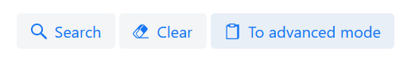

=== More searching 

Go ahead at set the *searchable* setting on the *members* attribute to
ALWAYS. After you do this and restart the application, you will see that
there now is a component that allows you to search for the members (to
be interpreted as: search for all organizations of which the selected
person is a member).

You will now see a search component for the *members* attribute that
looks as follows:

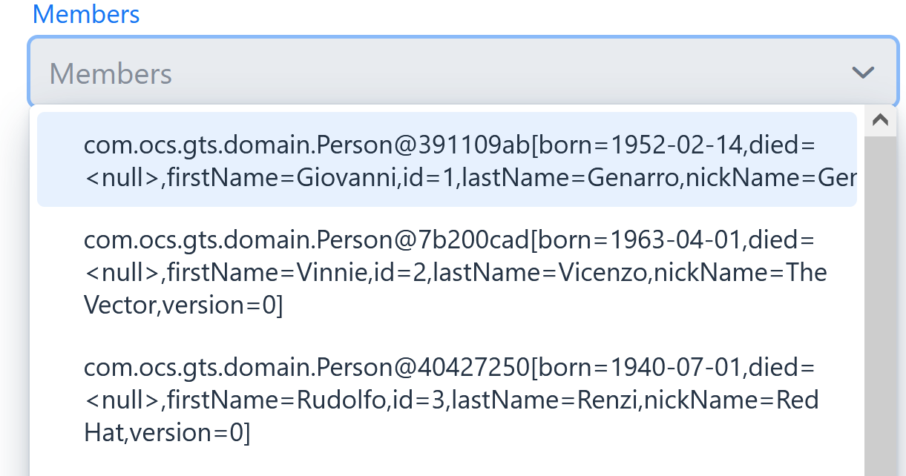

This is what we call a *token select field.* To use it, place your
cursor at the start of the field then just start typing. When you select
an item from the list, it will show up inside a rectangle inside the
component.

However, note that instead of a useful description, we just see the
default *toString* representation of the object inside the component.

To fix this, open the *Person* class and, at the top of the class, add
the *@Model* annotation like this:

@Entity

@Table(name = "person")

@Model(displayProperty = "nickName")

*public* *class* Person *extends* AbstractEntity<Integer> \{

*@Model* is like *@Attribute* except that it is placed on the entity,
not on one of its attributes. *@Model* supports several settings:

* *displayProperty* (which you saw above) determines which property to
use when displaying the entity inside a lookup component like a combo
box or a listbox. In the above example, we use the “nickName” property
of the Person as the display property. This leads to the following
representation:

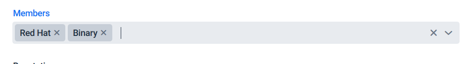

* *displayName* determines how the class will be called in the screen.
It defaults to the class name, with camel case replaced by spaces. E.g.
the display name of “Organization” is “Organization”.
* *displayNamePlural* is the plural name of the class. It defaults to
the *displayName* with an “s” added at the end, so you may have to
override this for some classes.
* *description* is a textual description of the entity. It will appear
as a tooltip in e.g. a search results grid.
* *sortOrder* takes a comma-separated list of fields and directions to
sort on. This sort order will be used if no specific sort order is
defined for a layout. It is also the sort order that will by default be
used inside e.g. combo boxes. The format of this property is similar to
a SQL sort order, e.g. “name” or “name asc” will sort by name in
ascending order, “name desc” will sort by name in descending order,
“name asc, age desc” will sort first by name and then by age.

Note that you place the annotation on the *Person* entity, not on the
*Organization* – this annotation will affect all references to the
Person entity, so it will show up like this in any search or edit form.

As you can see, by default the application will use a token select field
for searching inside a detail relation. You can modify this behaviour by
changing the value of the *selectMode* and *searchSelectMode* settings
on *@Attribute*:

* *selectMode* determines the type of UI component to render for this
property inside an edit form.
* *searchSelectMode* determines the type of UI component to render for
this property inside a search form (like the one we were working on). By
default, the framework will use the value of the *selectMode* setting
here but you can override it by explicitly setting a value for the
*SearchSelectMode* attribute.

Go ahead and set the *searchSelectMode* setting of the *members* field
to AttributeSelectMode.*LOOKUP*. Restart the application and verify that
you now see the following:

____

____

You will now see a “lookup field” which consists of a label that
displays the currently selected value(s), a button that brings up a
search dialog when clicked, and a button for clearing the currently
selected value(s).

Please note:

* You don’t normally have to specify a *searchSelectMode:* the
application will by default use the value of the *selectMode* if no
explicit *SearchSelectMode* is set.
* There are several other supported *AttributeSelectModes,* e.g.
*COMBO*, *LIST* and *LOOKUP*. These will be covered in more detail
later. Not all select modes make sense for every attribute. E.g. for
editing a one-to-one relation you cannot use the *TOKEN* setting since
this would allow you to select multiple values. The Dynamo framework
will produce an exception when you try to use an illegal select mode.

We have not added searching to the *countryOfOrigin* field yet – we’ll
come back to this later.

We will end this section with some additional remarks about searching:

* It is possible to set the *requiredForSearching* setting on the
*@Attribute* annotation to *true* – this means that you must enter a
value for the associated property before you can carry out a search.
Concretely, this means that the *Search* button will be disabled unless
you have filled in a value for all fields that are marked as
*requiredForSearching.*
* For fields that contain a time stamp (java.time.LocalDateTime or
java.time.ZonedDateTime), normally two search fields are rendered –
these can be used to set the upper and lower bound of the interval to
search on. However, if you set the *searchDateOnly* setting to *true*
then instead a single search field will be rendered. This field allows
you to select a date (rather than a time stamp) and when you perform a
search, only the records for which the date part of the value matches
will be returned.

=== Visual and textual tweaking

We now have a search screen that allows us to search on most fields, but
if we look at the screen there are still several things not in order:

* Instead of a textual representation of the various enumeration values
for the “Reputation” field, we get ugly warnings.
* The order of the fields in the grid is not as desired.
* The caption of the “headquarters” field wrongly reads “Head Quarters”
(it must not contain a space).

Luckily, the framework contains several ways of tweaking the visual and
textual representation of the generated screens.

First, let’s go back to the *@Attribute* annotation. Like *@Model*, it
has the *displayName, displayNamePlural,* and *description* values that
can be used to modify the captions and labels that are displayed on the
screen. Go ahead and use these to fix the caption of the “Headquarters”
search field.

Next, let’s change the attribute order – go to the *Organization* class
and add the *@AttributeOrder* annotation to the class as seen below

@Entity

@Table(name = "organization")

@AttributeOrder(attributeNames = \{ "name", "headQuarters", "address",
"countryOfOrigin", "reputation" })

*public* *class* Organization *extends* AbstractEntity<Integer> \{

Restart the application to verify that the attributes are now displayed
in the order specified above – note that this goes for both the search
form, the results grid, and the edit screen (which you will see later).
Also, note that some fields like “country of origin” do not show up yet
in the grid but we will cover this later.

Note that the attribute order is not complete – any attributes that did
not explicitly mention will be included behind the ones that you did
mention, in the default (alphabetical) order.

By default, the attribute order is used to determine the ordering in
both the edit form (more on this later), the results grid, and the
search form. If you would rather use a different attribute order for
your search form or the result grid, you can use the
*@SearchAttributeOrder* or *@GridAttributeOrder* to specify this.

@AttributeOrder(attributeNames = \{ "name", "headQuarters", "address",
"countryOfOrigin", "reputation" })

@GridAttributeOrder(attributeNames = \{ "memberCount",
"yearlyMortalityRate" })

*public* *class* Organization *extends* AbstractEntity<Integer> \{

In the above example, we have added an *@GridAttributeOrder.* Now when
you restart the application after this, you will see that the grid
starts with the “memberCount” and “yearlyMortalityRate’ fields. Note
that the other attributes are shown in alphabetical order.

OK, now it’s time to fix the enumeration. Open the
*ui.messages.properties* file and add the following:

Reputation.REALLY_NOT_FEARSOME=Really not fearsome#

Reputation.MILDLY_FEARSOME=Mildly fearsome#

Reputation.FEARSOME=Fearsome#

Reputation.EXTREMELY_FEARSOME=Extremely fearsome#

Restart the application and see how the enumeration values have now been
replaced by the values from the message bundle.

It can happen that you run out of room in a grid, i.e. you don’t have
enough horizontal room to display the full descriptions of all
attributes in the grid. In this case, you can limit the maximum length
of the value of an attribute inside the grid by setting the
*maxLengthInGrid* setting. Try this for the *name* attribute:

@NotNull

@Size(max = 255)

@Attribute(searchable = SearchMode.*_ALWAYS_*, main = *true*,
maxLengthInGrid = 10)

*private* String name;

Restart the application and verify that the values inside the name
column are now truncated after 10 characters:

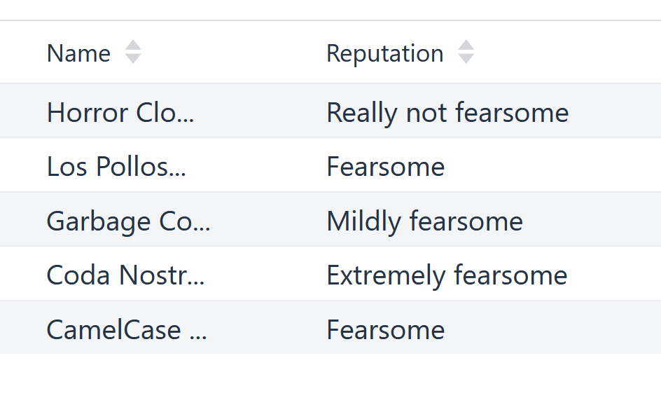

Now that we are talking about message bundles, it is a good moment to
point out that (almost) anything you can do by means of the entity model
annotations like *@Attribute* and *@Model* can also be achieved by means
a message bundle. For this, we use the *entitymodel.properties* message
bundle.

Open this file and add the following line:

Organization.yearlyMortalityRate.percentage=true

Restart the application and verify that we now see a percentage sign
(“%”) near the values of the “yearly mortality rate”. This teaches us
the following:

* The “percentage” setting can be used to specify that a (numeric) value
should be rendered as a percentage. This is purely visual (it will not
divide or multiply the value by anything).
* You can tweak the entity model using the message bundle. The syntax
for this is

*[entity name].[property name].[setting] = [value]*

You can also directly change the settings on the entity by not including
any property name, e.g. *Organization.displayName=Organisatie*

You can also change the value of the percentage setting using the
*@Attribute* annotation – this is just an example to show you that you
can also change it by using the message bundle.

To practice a bit more, add the following lines to
*entitymodel.properties*.

Organization.governmentSponsored.trueRepresentation=You bet!

Organization.governmentSponsored.falseRepresentation=No Way!

Then, restart the application and verify that instead of the standard
“true” and “false” values for the Boolean *governmentSponsored*
attribute, you will now see the custom descriptions shown above.

The exact syntax and all the names of the settings you can tweak is an
advanced topic and is covered in more detail in the Dynamo manual. For
now, the most important things to remember are:

* You can change attribute settings using the message bundle.
* Changes made using the message bundle will override changes made using
the annotations.

=== Localization of the attribute model

In the above you’ve seen that it is possible to use to @Attribute model
or message bundle to set the textual representation of an attribute or
entity. This works fine if you have a mono-lingual application but
becomes tricky if you have to modify these descriptions based on the
user’s locale. Fortunately, Dynamo also supports localization of these
textual representations by means of the standard Java message bundle
functionality.

Let’s demonstrate by changing the textual representations of the
*Organization* entity. First, open the GtsUI class and replace the line:

VaadinUtils._storeLocale_(*new* Locale("en"));

By the line:

VaadinUtils._storeLocale_(*new* Locale("nl"));

Here, we specify that the user that uses the application will use the
“nl” (Dutch) locale. For this example, we use a hard-coded value but it
is also possible to set the locale dynamically based on the user’s
browser settings (use VaadinRequest.getCurrent().getLocale()) for this.
Note that the *VaadinUtils.storeLocale* stores the settings in the
user’s session so this allows you to customize the locale on a
user-by-user basis.

Now, locate the *entitymodel.properties* file. In the same directory as
that file, create a file named *entitymodel_nl.properties* and add the
following to it:

Organization.displayName=Organisatie#

Organization.displayNamePlural=Organisaties#

Organization.name.displayName=Naam#

Restart the application and verify that the application now displays the
Dutch names of the entity (e.g. above the search results grid). The
column that contains the organization name should now also have the
caption “Naam”.

=== Relation fetching 

Now, let’s go back to the *Country of Origin* attribute that we skipped
before. We want to display this attribute in the grid, but it’s not
there yet. This is because it is a _complex attribute_ that refers to
another entity or collection of entities. By default, this type of
attribute is not shown inside a grid. To fix this, add the *@Attribute*
annotation to the *countryOfOrigin* property and set the *visibleInGrid*
setting to SHOW.

@NotNull

@JoinColumn(name = "country_of_origin")

@ManyToOne(fetch = FetchType.*_LAZY_*)

@Attribute(visibleInGrid = VisibilityType.*_SHOW_*)

*private* Country countryOfOrigin;

Now, restart the application and watch it *crash and burn*! You are
trying to display a property that is not retrieved from the database by
default(since it is set to lazy fetching, as you can see above).

Now, we can take the easy way out and set the fetching to eager, but
this is a dangerous practice since it can result in many extra queries
and potentially horrendous performance. So, the better option is to
fetch this relation as part of the retrieval of the organisations.

To fix this, go to the *OrganizationDaoImpl* class and add the following
code:

@Override

*protected* FetchJoinInformation[] getFetchJoins() \{

return FetchJoinInformation.of(*new*
FetchJoinInformation("countryOfOrigin"));

}

This will make sure that whenever any Organizations are fetched by the
framework, the *countryOfOrigin* relation of those organizations will be
fetched as well.

Fetching is an important concept in the Dynamo framework since it is a
powerful way to limit the number of queries that is carried out and can
thus be crucial for achieving good performance. Keep in mind though,
that if used poorly it can also lead to a lot of useless data being
retrieved with every request – imagine e.g. that the Country keeps track
of all its inhabitants: automatically fetching (millions or billions) of
inhabitants every time a country is fetched is clearly a bad thing and
must be avoided.

So, figuring out which relations to fetch and which not to fetch (or
whether to model those relations in the first place) can be an important
design decision. The framework also contains several ways to give you
more fine-grained control over this: the relations that you specify in
the DAO are the ones that are fetched by default, but you can override
this e.g. when calling service methods yourself or when creating
composite components like the *SimpleSearchLayout.* More specifically:

* The composite components like the *SimpleSearchLayout* have a
constructor that takes a vararg parameter that allows you to specify the
desired joins. If left empty the joins defined in the DAO will be used.
If you specify any joins in the constructor then those are the joins
that will be used when retrieving data to fill the results grid.
* Before you navigate to a detail screen (e.g. by selecting a row in the
results grid) the framework will retrieve the most recent state of the
selected entity. In this case, by default also the joins defined in the
DAO will be used. For this purpose, the joins defined in the constructor
are ignored but you can use the *setDetailJoins* method to specify the
joins to be used in this case.

Tips and tricks for dealing with this:

* If an entity has no or just a limited amount of joins, you do not
normally have to bother with overriding the joins and you can just use
the defaults from the DAO.
* If an entity has a lot of joins, you can improve the performance by
using the vararg constructor argument to make sure that only the
relations that are actually displayed in the grid are retrieved.

=== Domain Values

As you may have noticed, the *Country* class we have seen before isn’t
defined inside the GTS application – instead it comes from a Dynamo
module named *dynamo-functional-domain*. This contains some useful
classes for dealing with “domains”, also known as “code tables” or
“lookup tables”- they are basically simple entities that only consist of
a name, or of a name and a (unique) code.

The module contains several pre-defined domain classes like *Country*
which you can use if you include a database table named “domain” in your
application and fill it with the proper values (this is straightforward
so we won’t go into it here).

To properly use the values from the *Country* table, though, one more
thing is needed and that is a service for retrieving them from the
repository. Now, we could of course create the proper Java classes for
this, but this is slightly tedious and we can also use the Dynamo
functionality for _Default Services_ and define the required service in
Spring. Open the *ApplicationConfig.java* class and observe the
following code:

@Bean

*public* BaseDao<Integer, Country> countryDao() \{

*return* *new* DefaultDaoImpl<>(QCountry.*_country_*, Country.*class*,
"parent");

}

@Bean

*public* BaseService<Integer, Country> countryService(BaseDao<Integer,
Country> dao) \{

*return* *new* DefaultServiceImpl<>(dao, "code");

}

This defines a bean that is an instance of *DefaultServiceImpl* which
has an inner bean of type *DefaultDaoImpl.* These are convenience
classes that in turn inherit from the *BaseServiceImpl* and
*BaseDaoImpl* classes and provide all the basic functionality for
retrieving, saving, and deleting entities. The only catch is of course
that you cannot define any custom methods (e.g.
“*findCountriesInEurope*”) but for such simple entities, this is usually
not needed.

_Note: *ApplicationConfig* is an example of a Spring Boot configuration
class and inherits from the *ApplicationConfigSupport* class from the
Dynamo Framework. This class already takes care of some generic
configuration which cannot be taken care of by Spring Boot
automatically. When you build a Dynamo application it is advised that
you create a configuration class which inherits from
*ApplicationConfigSupport.*_

With all that explanation out of the way, we can now finally add search
functionality for the *CountryOfOrigin* field. Go ahead and do so
(remember, set *searchable* to true on @Attribute), then restart the
application and verify that you can now see a combo box that contains a
list of countries.

Note that this is another example of convention over configuration: the
*countryOfOrigin* attribute is a many-to-one relation (i.e. you can
select only one value by default) and therefore the default component is
a combo box. You can use the *searchSelectMode* and *selectMode* to
change this if you want to. Go ahead and change the *selectMode* to
*AttributeSelectMode.LOOKUP*:

@NotNull

@JoinColumn(name = "country_of_origin")

@ManyToOne(fetch = FetchType.*_LAZY_*)

@Attribute(searchable = SearchMode.*_ALWAYS_*, visibleInGrid =
VisibilityType.*_SHOW_*, selectMode = AttributeSelectMode.*_LOOKUP_*)

*private* Country countryOfOrigin;

Restart the application and observe how you can now use a popup dialog
to search for the country you want to filter on.

As an extra exercise, set the *multipleSearch* setting to *true.* This
allows you to search for multiple values for a normally single-valued
relation – the search query will return all entities that match one of
the provided search values. The *multipleSearch* setting is only
compatible with the (search)selectMode *LOOKUP* or *TOKEN*.

Finally, when you use a *LOOKUP* field for multiple search, you can use
the *multiSelectMode* to determine how you can select multiple items in
the search results grid of the popup dialog. The allowed values are
*ROWSELECT* (select multiple rows by Ctrl-clicking or Shift-clicking)
and *CHECKBOX* (select multiple rows by selecting the check box at the
start of every row).

== Adding, editing, and removing entities

=== Adding new entities

We’ve now done about all we can do to make our search screen behave in
the desired way, so let’s move on to adding new entities.

As you can see, there is already an *Add* button below the search
results grid. If you click this button, the application will navigate to
an edit form that allows you to add a new entity (in this case an
Organization) to the application.

By default, the form will already contain some input fields – as with
the search fields, the entity model determines which type of user
interface component is rendered for which attribute. The edit form looks
like this:

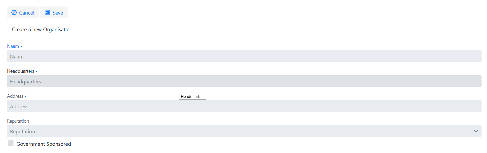

By now, it should not come as a surprise that you will see text fields
for String and numeric attributes, a combo box for an enumeration etc.
If you look closely, however, you will see that there are no components
yet for editing the *country of origin* and *members* attributes. This
is because, by default, no components will be created for editing
complex attributes.

To make the components for editing the complex attributes show up, you
can set the *complexEditable* setting for an attribute to true. We do
this now for the country of origin field:

@NotNull

@JoinColumn(name = "country_of_origin")

@ManyToOne(fetch = FetchType.*_LAZY_*)

@Attribute(visibleInGrid = VisibilityType.*_SHOW_*, searchable =
SearchMode.*_ALWAYS_*, selectMode = AttributeSelectMode.*_LOOKUP_*,
complexEditable = *true*)

*private* Country countryOfOrigin;

Now, go ahead and add a new organization to the system (be creative).
Note that validations have automatically been added to the form based on
the Java Validation API annotation like *@NotNull* and *@Size* that are
present on the entity – you don’t have to do anything extra for this.

Note that sometimes it’s not desirable to be able to directly edit an
attribute – e.g. in case of a status field that is automatically set, a
creation time stamp, etc. You can make sure that such an attribute shows
up as read-only in the form by setting the *editable* setting of the
@Attribute annotation to *READONLY.* It is also possible to specify the
settings *CREATE_ONLY* and *EDITABLE*. When you use the setting
*CREATE_ONLY* you will only be able to edit the attribute when creating
a new entity. The *EDITABLE* setting, which is the default value, means
that the attribute can always be edited.

=== Editing existing entities

Note that below the search results grid you will also see a button named
*Edit*. If you select a row in the grid and then press this button you
will be taken to a detail screen that displays an edit form for the
selected entity.

Some changes you can make to modify the behaviour of edit forms include:

* Use the *defaultValue* setting on any simple attribute to define a
default value. This can be a string, integer, BigDecimal etc. Try this
out on e.g. the “*yearlyMortalityRate*” attribute. Use a period (“.”) as
the decimal separator if needed. Once you click the *Add* button to
create a new entity, any fields for which a default value has been
defined will be automatically filled with this default value.
* Use the *TextFieldMode* to switch between displaying a text field, a
text area, or a password fieldf. Try this on the *address* property.
_Note: this only works inside edit forms. The TextFieldMode will be
ignored when creating a search form, since the text area in the search
form would take up too much space and it’s highly unlikely you’d want to
search for an enormously long string match anyway._
* Use the *numberFieldMode* to switch between using a text field or a
numeric input field for a numeric property (this currently only works
for properties of type “int” or “Integer”, and only when they are not
also set to “percentage = true”). When you set this to “NUMBERFIELD”,
e.g. for the “memberCount” property, you will see the following:

____
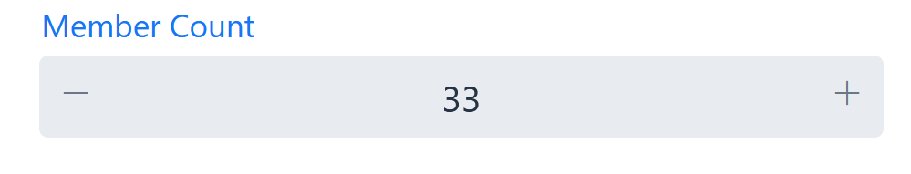

This is a numeric input field which will only accept numeric input and
also contains plus and minus buttons for changing the value. You can use
the *numberFieldStep* setting to modify the step size.
____

* You can use the *groupTogetherWith* setting to specify that multiple
components must be placed on the same row in the edit form. To do so,
use a *groupTogetherWith* value on the attribute you want to appear
*first* in the row:

@NotNull

@Size(max = 255)

@Attribute(searchable = SearchMode.*_ALWAYS_*, displayName =
"Headquarters", groupTogetherWith = "address")

*private* String headQuarters;

* The above will make sure that the “address” field shows up on the same
line as the “headQuarters” field. When using this setting, take care
that the attributes are in the right order (the attribute on which you
place the *groupTogetherWith* setting must occur in the ordering before
the attribute it refers to. Dynamo will provide warning messages if you
create a situation that contains an incorrect ordering.

You have some control over how the grouped together field behave with
respect to various screen sizes. First, you can set the
ocs.default.group.together.mode system property to either “pixel” (the
default) or “percentage”. When set to “pixel”, each input field has a
minimum width, as specified by the system property
ocs.default.group.together.width . (Note that you set

If there is not enough room to display all the fields after each other,
they will be placed on a new line. However if you set the mode parameter
to “percentage”, the field will always stay together on the same line,
with each field occupying the same portion of the available space.

=== URL fields

The Dynamo Framework also supports the functionality of turning certain
fields into clickable URLs (that point to external resources).

To demonstrate, add the following code to the *Organization* class:

@Attribute(url = *true*)

*private* String url;

Then, start the application and verify that in the grid in the
Organizations screen you will now see an empty “URL” field. Navigate to
the edit screen and fill in a value.

Enter some valid URLs for some of the Organizations, then look at the
search results grid and check that the URL column now contains clickable
links that can be used to take you to directly to the pages identified
by the URLs you entered.

The clickable URL field will also show up inside a detail view that is
in view mode.

=== Column and form width

By default, an edit form will contain just a single column containing
the input fields. It will also not take up the entire width of the
screen. Both of these things are fairly easy to change.

If you want to change e.g. the number of columns being used, you can
modify the value of the system property
ocs.default.edit.form.column.thresholds. To test this, open the
*application.properties* file and add the following:

ocs.default.edit.form.column.thresholds=0px,600px,1200px

Now, if you restart the application you will see that the edit fields
are divided over three columns as long as the screen is at least 1200
pixels wide, and over two columns if the screen is between 600 and 1200
pixels wide.

To go back to the default situation (one column) you can remove the
property again, or set it to just “0px”.

If you want a single column, but you don’t want it to stretch across the
entire screen, you can limit the form width by adding the following to
application.properties:

ocs.default.max.edit.form.width=1000px

For search forms, you can achieve the same with the properties
ocs.default.search.form.column.thresholds and
ocs.default.max.search.form.width

Note that when you want to override the settings for just a single
screen/layout, you can use the *setXXXColumnThresholds* methods to do
so, e.g. SimpleSearchLayout has a “setEditColumnThresholds” method and a
“setSearchColumnThresholds” method.

=== Attribute Grouping

By default, all attributes inside an edit from will be displayed below
and behind each other, in the order specified by the *@AttributeOrder*
annotation you saw before (with an exception for the attributes that
have been mentioned in the *groupTogetherWith* setting). However,
sometimes, especially when you have many attributes, it can be useful to
have a way of grouping certain attributes together.

To demonstrate how this works, modify the *Organization* view so that it
reads as follows:

@Entity

@Table(name = "organization")

@AttributeGroup(messageKey = "organization.first", attributeNames = \{
"name", "address", "headQuarters", "countryOfOrigin" })

@AttributeGroup(messageKey = "organization.second", attributeNames = \{
"reputation" })

@AttributeOrder(attributeNames = \{ "name", "headQuarters", "address",
"countryOfOrigin", "reputation" })

*public* *class* Organization *extends* AbstractEntity<Integer> \{

Here, you define two attribute groups identified by the message keys
“organization.first” and “organization.second” and place some attributes
in each group.

In the *entitymodel.properties* file, add the following lines:

*organization.first=First*

*organization.second=Second*

Restart the application and verify that the edit form now looks as
follows:

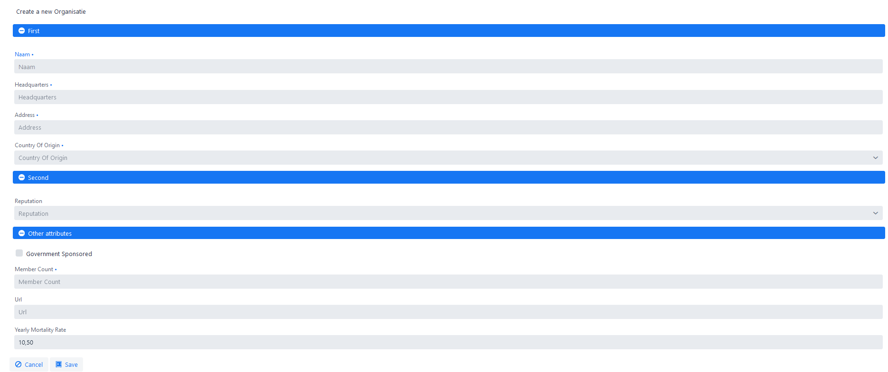

You will see three attribute groups: the two groups you declared and an
additional group that contains all attributes that were not explicitly
assigned to any of the groups.

Note that the order of the groups is specified by the
*@AttributeGroup(s)* annotations, but the order of the attributes within
the groups is still taken from the (general) attribute ordering
specified by the *@AttributeOrder* annotation.

Also, by default the application will use panels to group the attributes
together. If you prefer tabs, go to the *OrganizationView* class again
and change the form options so they read as follows:

FormOptions fo = *new*
FormOptions().setAttributeGroupMode(AttributeGroupMode.*_TABSHEET_*);

After you restart the application you will see that the attributes have
now been placed on three tab sheets:

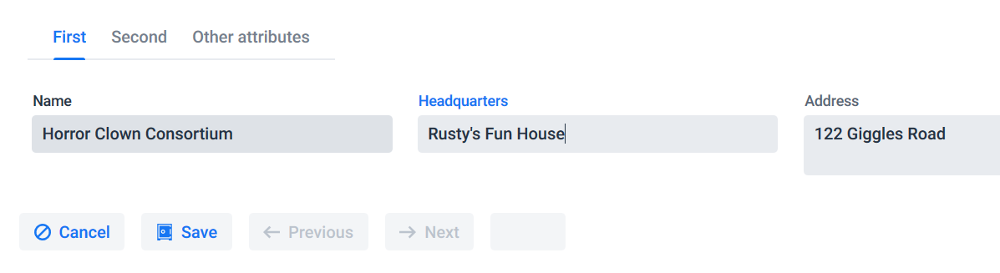

===  Removing existing entities

To enable the functionality for removing entities, modify the
*FormOptions* object as follows:

FormOptions fo = *new* FormOptions().setShowRemoveButton(*true*);

Restart the application and verify that you can now remove Organizations
from the system (be careful and don’t throw them all away!).

=== Some other FormOptions settings

As you may have seen already, the *FormOptions* parameter object comes
with a lot of other settings. Not all of them make sense in every
context/component, but there are several more that you can use to modify
the behaviour of the *SimpleSearchLayout.*

* *ConfirmClear* determines whether to ask for confirmation before
removing all search filters after the user presses the *Clear* button.
The default value is *false*.
* *ConfirmSave* determines whether to ask for confirmation before saving
changes after the user presses the *Save* button. The default value is
*false.*
* *OpenInViewMode* determines whether to open the edit from in view mode
first. This is disabled by default so that you can start editing right
away.
* *DetailsModeEnabled* determines whether the details screen is enabled.
If you set this to false then no edit/view button will show up below the
search results grid. You can still add new entities though.
* *SearchImmediately* determines whether to carry out a search right
away when opening the screen. The default value for this setting is
*true* which means that a search is carried out right away. If you set
it to *false*, the search results grid will be hidden after you open the
screen and you must carry out a search first before it will show up.
* *ShowToggleButton* determines whether to display a “toggle” button
which allows you to toggle between displaying and hiding the search form
so that you can have more room for the search results on the screen.
* *ShowNextButton* and *ShowPrevButton* can be used to add a *Next*
button respectively a *Previous* button to the button bar while you are
in a detail screen. This allows you to easily navigate between the
records in a result set without the user having to leave the detail
screen. Instead of using the individual settings you can also use the
*ShowIterationButtons* setting to show/hide both iteration buttons at
once.
* *PreserveSearchTerms* determines whether any search terms that you
enter in a search form will be preserved when you navigate away from a
screen and then navigate back to it. This is enabled by default so you
don’t normally need to do anything to get this functionality.
* *PreserveSortOrders* determines whether any sort orders that you
select in a results grid will be preserved when you navigate away from a
screen and then navigate back to it. This is enabled by default so you
don’t normally need to do anything to get this functionality.
* *ShowRefreshButton* can be used to make a “refresh” button appear in
the detail screen of a search layout. This button can be used to refresh
the state of the currently selected entity without having to navigate
away from the detail screen.

=== Adding your own lookup tables

It is also fairly easy to define your own lookup tables. As a case in
point, take a look at the “MainActivity” class. This defines the main
activity of an Organization. In order to use it in the application,
modify Organization.java so that it reads the following:

@JoinColumn(name = "main_activity")

@ManyToOne(fetch = FetchType.*_LAZY_*)

@Attribute(quickAddAllowed = true, complexEditable = *true*, searchable
= SearchMode.*_ALWAYS_*, visibleInGrid = VisibilityType.*_SHOW_*,
multipleSearch = *true*, searchSelectMode =
AttributeSelectMode.*_TOKEN_*)

*private* MainActivity mainActivity;

Also, modify the OrganizationDaoImpl so that the “mainActivity” is
included in the fetch joins:

@Override

*protected* FetchJoinInformation[] getFetchJoins() \{

*return* FetchJoinInformation._of_(*new*
FetchJoinInformation("countryOfOrigin"),

*new* FetchJoinInformation("mainActivity"));

}

Now, when you open the detail page for an organization, you should see a
“Main Activity” field in the edit form:

image:media/image12.png[Rectangle
Description automatically generated with medium
confidence,width=494,height=73]

Behind the input component, you will see a “plus” button that allows you
to quickly add a new value for this lookup table. This button appears
because you have set the “quickAddAllowed” setting to *true*. Clicking
the button will bring up a dialog that allows the user to create a new
entity. If the creation is successful, the new entity will be added to
the list of available options in the component, and selected.

Dynamo contains automatic protection against entering duplicate values –
when you try to add a new lookup table value with the same name as an
already existing entity, the application will throw a validation
exception. The message that is shown is expected to be in the message
bundle under the *<DomainName>.not.unique* key. To make this work for
the MainActivity, add the following to entitymodel.properties

MainActivity.not.unique=This main activity already exists

Now, restart the application, try to add a duplicate main activity and
verify that see the error message defined here.

=== Some additional attribute model settings

The attribute model currently support around 60 separate settings.
Although we refer you to the Dynamo manual for a complete listing, it’s
good to briefly outline some additional settings here:

* The Dynamo framework supports automatic validation of emails (syntax
only) for fields that are annotated with the Java Validation @Email
annotation. Simply adding this annotation is enough to enable e-mail
validation in both the service layer and UI.
* The setting *ignoreInSearchFilter* can be used to specify that a
property should be ignored when constructing the search filter when
searching in a SearchLayout. When you mark an attribute as “searchable”
but set “ignoreInSearchFilter” to true, a search field will be rendered
inside the form, but the contents of the field will be ignored when
actually searching. The most obvious use for this is when working with
cascaded fields (outside of the scope of this training).
* Sometimes, when searching or sorting on an attribute, you will want to
search or sort on an attribute path that is different from the actual
path to the attribute. For these situations, you can use the
*replacementSearchPath* and *replacementSortPath* settings.

== Adding a SplitLayout

Now, let’s move to the *Person* entity which is used to represent the
various members of the criminal organizations we are interested in.

As with the *Organization* entity, the entity class, DAO, and service
classes have already been provided for you. There is also a skeleton
implementation of the *PersonView* class that represents the screen for
browsing the persons available in the system.

=== Expanding the navigation

First, let’s ensure that we can navigate to the new screen – as you may
have noticed, the application already contains a menu bar which
currently holds just one menu item named Organizations. Let’s add the
new screen to the menu.

Open the *menu.properties* file and check that it contains the
following:

gts.menu.1.displayName=Organizations

gts.menu.1.destination=organizationView

This file contains a declarative definition of the menu. Each line
starts with a prefix (can be anything) that allows you to define
multiple menus and potentially switch between them if needed. In this
case, the prefix is *gts.menu*.

After that, there is a number (starting at 1) that indicates the main
menu item. You can nest menu items by including additional numbers
behind the first one. The numbers must be separated by periods.

For now, we replace the main menu item “Organizations” by a new main
menu item “Top Level Menu” that contains two sub-items, one for
Organizations and one for Members. Modify the menu to look as follows:

gts.menu.1.displayName=Top Level Menu

gts.menu.1.1.displayName=Organizations

gts.menu.1.1.destination=organizationView

gts.menu.1.2.displayName=Members

gts.menu.1.2.destination=personView

Here, you can see that for every menu item we can specify:

* The *displayName* is the caption of the menu item.
* The *destination* is the logical name of the view. This must match the
name as it is defined in the View (OrganisationView, PersonView etc.) to
navigate to. Note that for the “Top Level” Menu item we don’t specify a
destination, since this menu item only serves as the parent for the menu
items below it and can’t be used to directly navigate to a screen.

In addition, you can specify:

* The *description* which is the tooltip that will appear when you hover
the mouse over the menu item.
* The *screenMode* can be used to set a screen mode. This can be
retrieved inside you view (via a method on the *BaseView* class) and can
help you render a screen in a specific state or mode.
* The *tabIndex* can be used to set the index of a tab to display, when
the view you navigate to contains a tab sheet with multiple tabs and you
want to specify which one to display after opening the screen.

This covers the basic menu functionality for now. Let’s go back to the
actual screen.

=== Implementing a SplitLayout

Now, if you open the Members screen, it will basically be empty. Let’s
change that by adding a *SplitLayout* to it. A *SplitLayout* is a layout
that consists of two parts: a results grid and an edit form. These two
parts can be displayed below each other or next to each other (with the
latter being the default). You can use the *ScreenMode* setting on the
*FormOptions* parameter object to modify this.

Using everything you have learned before (and by borrowing from the
*OrganizationView*), add an instance of the *ServiceBasedSplitLayout*
that displays *Persons* to the *PersonView.* As with the
*OrganizationView*, you must retrieve an Entity Model, create a
*FormOptions* object, and instantiate the layout component.

Restart the application and verify that the new screen looks like this:

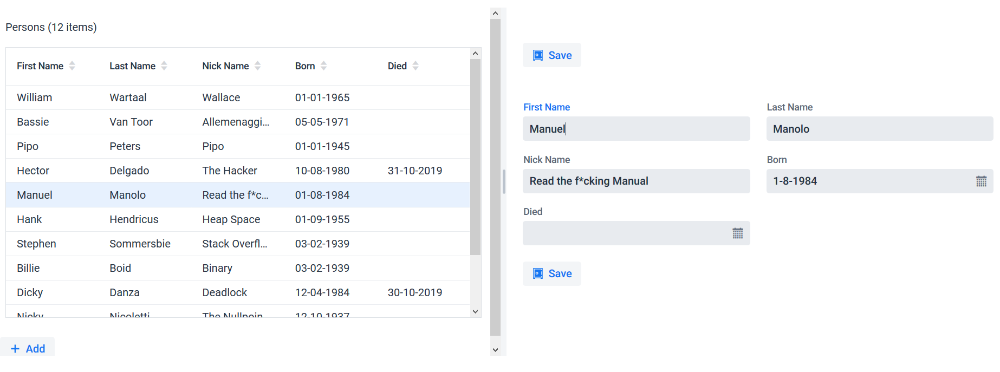

Now, using everything you have learned so far, modify this screen:

* Make sure the “organization” property shows up in the grid and in the
edit form (note: don’t forget to modify the relation fetching inside the
*PersonDaoImpl* and to set a *displayProperty* for the Organization if
that has not been done already__).__
* The attribute order reads “firstName”, “nickName”, “lastName”,
“organization” “born”, “died”
* The caption for the *nickName* property must be changed to “Nickname”
* The *Remove* button must be displayed below the search results grid.

Play around with the screen a bit and add, edit, or delete some
entities.

Now, it’s time to look at some of the details of the *SplitLayout*:

* It comes in two varieties, the *ServiceBasedSplitLayout* and the
*FixedSplitLayout.* The *ServiceBasedSplitLayout* we use here retrieves
its data from the database. The *FixedSplitLayout* can be initialized
with a fixed collection of data you already have in-memory (e.g. as the
result of an earlier fetch query).
* Both varieties of *SplitLayout* have a subclass
(*ServiceBasedDetailLayout* and *FixedDetailLayout*) that holds a
reference to a parent object. This would e.g. allow you to easily create
a screen that displays all members of a certain organization.
* By default, the *ServiceBasedSplitLayout* displays all entities of a
certain type, i.e. there is no filtering. You can add filtering by
calling the *setFilterCreator* method, e.g.

layout.setFilterCreator(() -> *new* EqualsPredicate<>("firstName",
"Manuel"));

filters the component so that only members with first name “Manuel” show
up.

The *FormOptions* class contains several settings for modifying the
behaviour of a *SplitLayout*:

* The *screenMode* can be used to switch between a horizontal (the
default) and a vertical representation (in which case the edit form is
placed below the search screen).
* The *showQuickSearchField* setting can be used to display a quick
search field above the search results grid. This allows you to quickly
filter the results grid by typing in the search field. By default, the
application will search using a String match filter on the *main*
attribute of the entity. The main attribute is automatically determined
by the framework and is set to the first attribute of type String that
is encountered You can use the *setQuickSearchFilterCreator* method to
change this.

Using the the *setQuickSearchFilter* method looks as follows:

FormOptions fo = *new* FormOptions().setShowQuickSearchField(*true*);

ServiceBasedSplitLayout<Integer, Person> layout = *new*
ServiceBasedSplitLayout<Integer, Person>(personService,

em, QueryType.*_ID_BASED_*, fo, *null*);

layout.setQuickSearchFilterCreator (text -> *new*
LikePredicate<Person>("firstName", "%" + text + "%", *false*));

As you can see, the method expects a function that maps from a String
(the search term) to a *SerializablePredicate.* This is an interface
from the Vaadin framework that allows you to construct complex search
filters. The framework Vaadin offers for this is rather abstract, but
Dynamo offers concrete implementations of many common filters, e.g.
*EqualsPredicate, GreaterThanPredicate, LessThanPredicate* for comparing
values, *AndPredicate* and *OrPredicate* for constructing composite
filters, and many others. Please consult the Dynamo manual for a full
listing.

We will return to the *SerializablePredicate* in a little while when we
cover field filters and default filters for search forms.

A relatively new addition to the *SplitLayout* is the ability to use a
pop-up search dialog to filter the records that are being shown.

To use this property, we first need to make sure that one or more of the
attributes of the Person class are set to searchable. So, open the
Person class and use the *@Attribute* annotation to set the “firstName”
and “lastName” to searchable (SearchMode.ALWAYS).

Next, all you have to do is set the “showSplitLayoutSearchButton”
setting on the FormOptions to true. After this, you will get to see two
new buttons above the results grid:

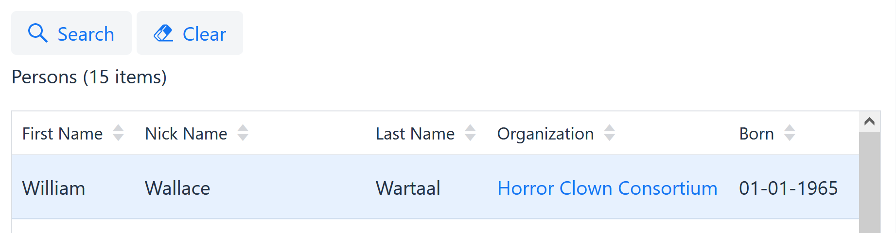

Clicking the “Search” button will bring up a dialog containing the by
now familiar search form. You can use this dialog to perform a search to
limit the results. Once you close the dialog, the search filters from
the dialog are applied to the results grid. Use the “Clear” button to
remove these search filters and revert to the original filtering.

Note: it is possible to use this search button in conjunction with the
quick search field. Using the quick search field will further restrict
the results show in the grid after using the search button, but will
have no effect on the search dialog that shows up after you click the
“Search” button.

== Beware of gangsters bringing gifts

Now, we are finally getting to the good stuff – we are going to add a
screen to manage the various types of gifts that are being sent around.

Open the *GiftView* class and add a *SplitLayout* to this view, similar
to how you already added a layout to the *PersonView.*

After the declaration of the layout, add this single line:

layout.setDetailJoins(*new* FetchJoinInformation[] \{ *new*
FetchJoinInformation("logo") });

This is needed because of a peculiarity with dealing with BLOB (binary
large object) files in PostgreSQL, which is beyond the scope of this
training.

Now, expand the menu in *menu.properties* in order to include this extra
screen (simply add another item under the “Top level menu”). Start your
application and verify you have a basic but working screen for browsing
gifts.

One of the functionalities of the gifts screen is the option to upload
an image to help us identify what the gift looks like. You will see that
the application will automatically render a set of upload components.
Currently, this should look like this:

You can upload a file using these components, but the application will
currently not show a preview. To fix this, open the *GiftLogo* class and
find the *image* attribute. Annotate it as follows:

@Lob

@Attribute(image = *true*, fileNameProperty = "logo.fileName")

*private* *byte*[] image;

Also annotate the *fileName* property directly below it as follows:

@Attribute(editable = *EditableType.READ_ONLY*, visibleInGrid =
VisibilityType.*_HIDE_*)

*private* String fileName;

By changing the value of the *image* setting to true you mark this field
as an image, causing the application to try and render a preview of the
contents of this field (it will of course still fail if you didn’t
upload an image, but more on this soon).

The *fileNameProperty* setting is used to automatically set the value of
another property to the name of the file you uploaded – in this case the
*fileName* property on the *GiftLogo.*

Now, if you want to restrict the type of files that the user can upload,
you can use the *allowedExtensions* setting. This setting takes as its
value an array of strings, e.g. \{“png”, “gif”}

Play around with the file upload functionality for a while if you want,
then have a look at the rest of the screen and make sure you get all the
little details right (attribute order, captions etc.)

Note: when you refer to the attributes “image” and “fileName” on the
*GiftLogo* class, make sure to use their full paths, i.e. “logo.image”
and “logo.fileName”.

If you look closely at the code in the *Gift* class, you will see that
the *logo* is annotated with *embedded = true.* This can be used to
embed an entity (the *GiftLogo*) in its main entity (the *Gift*)*.* An
embedded entity does not get its own entity model. Instead, the
attributes of the embedded entity (e.g. “image” and “filename”) are
created as attributes of the main entity and can only be referenced
using their full paths (e.g. “logo.image”).

== Deliveries and editable grids

Now, let’s add a screen for managing the various gift deliveries from
one criminal to the other. First, open the *menu.properties* file again
and add the following:

gts.menu.2.displayName=Deliveries

gts.menu.2.destination=deliveryView

This will add a new top-level menu item that will lead to the
*DeliveryView* screen. Like the other screens, this screen will
initially be empty. Using what you have learned, add an
*EditableGridLayout* component to this view. Make sure the *Remove*
button shows up in this layout (use the *FormOptions*).

EntityModel<Delivery> em = getModelFactory().getModel(Delivery.*class*);

FormOptions fo = *new* FormOptions().setShowRemoveButton(*true*);

EditableGridLayout<Integer, Delivery> layout = *new*
EditableGridLayout<>(deliveryService, em, fo, *null*);

main.add(layout);

Now, when you restart the application and open the Deliveries screen,
you will see a grid in which you can edit the displayed entities.
Currently, the grid will be empty but you can use the *Add* button to
add new entries. However, this is not very useful at the moment since
you won’t be able to see (let alone fill in) all the required fields.

Open the *Delivery* class and add the proper annotations so that the
“fromPerson”, “toPerson” and “gift” fields will show up in the grid (use
the *visibleInGrid* setting for this) and also set the *complexEditable*
settings to *true.*

Also, modify the attribute order so that is reads “date”, “fromPerson”,
“toPerson”, “gift”, “remarks” and make any other tweaks you think are
necessary.

Now, start the application, open the new screen, and you should see
something like this:

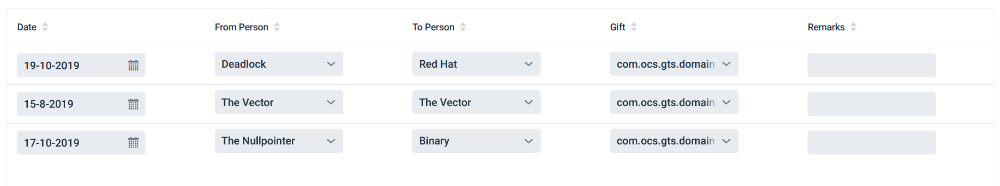

Currently the grid will be empty but you can use the *Add* button to add
a new delivery. Clicking the *Add* button will cause a pop-up dialog to
appear, which you can then use to create the new entity. Go ahead and do
so. The new entities that you added will show up in the grid.

Note that by default the grid still appears to be in read-only mode, but
you can click on a row in the grid to open an in-line editor component.
You can click on the save button to persist your changes or

If you would rather edit multiple rows at once you can you can do so by
changing the *gridEditMode* on the FormOptions to *SIMULTANEOUS:*

FormOptions fo = *new*
FormOptions().setGridEditMode(GridEditMode.*_SIMULTANEOUS_*);

This will cause all rows in the grid to appear in editable mode, and
will cause a *Save* button to show up below the grid. Any changes you
make will only be stored after you press this Save button.

The *EditableGridLayout* can be quite useful in (although its use is
admittedly a bit contrived here) but keep a couple of things in mind:

* If the edit mode is set to *SIMULTANEOUS* a lot of input components
have to be displayed simultaneously. This can have a large impact on
memory usage and performance. We advise sticking with the *SINGLE_ROW*
mode unless you know that the number of entities you that will be
displayed is limited (typically no more than a couple of dozen).
* It can be a bit awkward to use multi-line components like List Select
inside a grid. You can use the *gridSelectMode* setting on @Attribute to
specify which type of component to use inside an editable grid. This
overrides the value of the *selectMode* setting for use inside editable
grids only.
* For an attribute of type String, Dynamo will always render a text
field (rather than a text area) inside an editable grid. The value of
the *textFieldMode* will be ignored in this case.

Note that when you are using a lot of components that are used for
selecting entities from a list (e.g. combo box or token fields) then by
default, the components share the same data provider meaning that Dynamo
will only issue one query to retrieve the list of options which is then
shared between all components. This only works when the _paging mode_
for the component is set to *NON_PAGED*. The paging mode of a component
is taken from the value of the system property *ocs.default.paging.mode*
but can be overwritten for a specific attribute using the @Attribute
annotation.

So, inside an *EditableGridLayout* you will usually want to stick to
NON_PAGED so that the data can be shared. In other situations, you might
want to use PAGED if the number of options to choose from becomes very
large. Or, even better, you might want to change to a LOOKUP component
instead.

== Filters, custom components, and callback methods

The above chapters should have given you a good idea of some of the
capabilities of the Dynamo Framework, but it can do a lot more. We will
now go over some of the more common use cases.

=== Field Filters and component construction

So far, you have only seen occasions in which a combo box or other
lookup component contains all the available values. In a small
application like this, that is usually not an issue, but in a real
application it is likely that you sometimes want to restrict the values
that show up inside a selection component or lookup component. For this
you can use the *field filter* mechanism.

Most composite layout components available in the framework will accept
a map that maps from an attribute name to the filter (actually, the
*SerializablePredicate* that we mentioned before) to apply to the field
for that attribute.

Modify the code inside the *OrganizationView* by adding the following
code below the declaration of the *SimpleSearchLayout*

layout.addFieldFilter("countryOfOrigin", *new*
LikePredicate<String>("name", "%au%", *false*));

Now, restart the application and verify that in the Organizations
screen, you can only select countries of which the name contains the
value “au” (open the search dialog, perform a search, and verify that
the names of all returned countries contain the value “au” at some
point).

Play around with the filters a bit more if you like – but note that this
mechanism can only be used for selection components like combo boxes and
lookup fields.

_Note: currently, the field filter mechanism doesn’t allow you to
distinguish between the components in the search form and the component
in the edit form. This is something that will potentially be addressed
in a future version of the framework._

Another thing to note is that you must only set the state of the
composite component before adding the layout to its parent layout – this
is because the component construction typically occurs when the
component is added to the layout – before that happens you can modify
settings like the field filters.

You can also change some other attributes of the layouts, e.g.:

* *setDefaultFilters* can be used to configure any filters that should
*always* be applied to any search. By default, the composite layouts
will simply display all the entities of a certain type. But if you
specify any additional filters, these will always be applied to any
search (even if no search filters are set at all within the search form
– and they persist after you reset the form by pressing the *Clear*
button).

The consequence of the way in which components are built is that if you
want to modify the component _after_ it has been constructed, or during
construction, you must use a callback method. This will be discussed
later.

=== Custom fields and detail grids

The field filter mechanism can be used to modify the behaviour of
selection components, but sometimes this is not enough. Therefore, the
framework offers the option of directly interfering in the component
creation process. You can do this by invoking the *addCustomField*
method on a composite component.

For example, we can do the following in the *OrganizationView*:

layout.addCustomField("address", context -> \{

ComboBox<String> cb = *new* ComboBox<String>(

context.getAttributeModel().getDisplayName(VaadinUtils._getLocale_()));

ListDataProvider<String> dataProvider = *new* ListDataProvider<>(

Lists._newArrayList_("1234 Palomita Boulevard", "5678 Horseshoe Road"));

cb.setDataProvider(dataProvider);

cb.setRequiredIndicatorVisible(*true*);

*return* cb;

});

This works as follows:

* The first parameter (“address”) indicates the name of the attribute
for which we want to add a custom field.
* The second parameter is a lambda function that takes a “context” as
its argument, and returns a constructed component. The context contains
references to the entity model that is used to construct the entire
(edit or search) form, the attribute model, and indicators for checking
whether the component is being constructed for a search screen, or
whether the screen is in view mode

In the above, we add a combo box that contains a number of predefined
options for setting the address. Since we don’t do any additional checks
to see if the component is meant for search mode, the custom component
will be used both in the search form and in the edit form.

It will (hopefully) not often be necessary to use this functionality
often but it is there in case you need it. It will be most useful when
you are dealing with the inline editing of dependent (one-to-many)
relations, which we will cover below.

To clarify, please consider that there are two types of one-to-many
relationship: relationships in which the detail entities can exist by
themselves, and relationships in which the detail entities are an
integral part of the master entity. As an example of the first, consider
the one-to-many relationship between Organization and Person: The
Persons clearly continue to exist even if the Organization somehow
ceases to exists (unless of course the headquarters with everybody in it
is blown up, but I digress). Contrast this with the classic example of
an order with order lines: the order lines are an integral part of the
order and can’t and won’t exist without the order.

In the former case, the detail entities exist regardless of the parent,
and it usually suffices to simply select them from a pre-existing list.
In the latter case, the detail entities are usually created and edited
as part of the creating or editing of the master entity.

For this last situation, the Dynamo Framework contains functionality to
create a grid component that can be used to directly add, edit, and
remove detail entities while editing the parent entity. This component
is called a *DetailsEditGrid* and must also be added to a form by using
the *addCustomField* method described above.

Let’s try this out – go to the *Gift* class and change the
*complexEditable* setting on the *translations* property – this property
is meant to hold a collection of translations of the name of the Gift in
various languages.

Also, in the *GiftView*, change declaration of the layout as follows:

EntityModel<Gift> em = getModelFactory().getModel(Gift.*class*);

FormOptions fo = *new* FormOptions().setShowRemoveButton(*true*);

GiftLayout layout = *new* GiftLayout(giftService, em, fo, *null*);

layout.setDetailJoins(*new* FetchJoinInformation[] \{ *new*
FetchJoinInformation("logo"),

*new* FetchJoinInformation("translations") });

You will notice how we replace the layout with a subclass named
*GiftLayout*. Inspect this class and see how inside it, we call the
*addCustomField* method and use it to create a *DetailsEditGrid.*

Now, start the application and observe that inside the edit form a grid
shows up that allows you to add, edit and remove translations. Go ahead
and play around with it for a bit.

There is one more thing to consider when working with a *DetailsEditGrid
–* it always operates on in-memory data and does not communicate with
the database directly. Instead, as you can see in the example code, it
works by adding/removing detail records from the parent object (in this
case the Gift) and then saving that parent object – and the details
along with it. This makes sense since the details cannot exist by
themselves anyway but it has some consequences:

* When using JPA, make sure to define cascading for the *merge* and
*persist* operations.
* If you try to add multiple detail entities at once, these entities are
held in-memory without a primary key for a short amount of time. If you
take no special action, then these objects will be considered equal by
JPA, and when you try to save them only one will be persisted. You can
prevent this by overriding the *equals* method and ensure that entities
without a primary key will never be considered equal. See the
*GiftTranslation* class for an example.

Note: you will see that the “language” field is now a free text field.
This would of course be a good candidate for an enumeration or a domain
entity but for the sake of simplicity we decided to stick with a text
field.

Note: it is also possible to use the *DetailsEditGrid* in a different
mode, namely for managing a many-to-many relationship. This can be done
by setting the *detailsGridSearchMode* parameter of the FormOptions that
you pass to the constructor to *true.* This will cause the
*DetailsEditGrid* to be in read-only mode and will cause a button to
appear that brings up a search dialog. This is useful if you want to
link existing entities to the entity you are editing, not for creating
new detail entities.

Version 2.1 of the Dynamo Framework introduced a new variant of the
*DetailsEditGrid* named *ServiceBasedDetailsEditGrid* which can be used
to manage larger relations using a lazily loaded grid. See the full
Dynamo documentation for more information about this component.

Finally, Dynamo 2.10 introduces two new settings on the form options:

* *showDetailsGridDetailPanel* can be used to specify that a panel
containing data about the currently selected item will show up below the
grid.
* *showDetailsGridPopup* can be used to specify that a button will show
up below the grid that will bring up a popup to show the details of the
currently selected item.

Both of these options are only available when the grid is in read-only
mode.

=== Detail Layouts

Instead of using a *DetailsEditGrid* to manage a dependent one-to-many
collection, you can also use a *DetailsEditLayout.* This is a component
that functions in roughly the same way as the *DetailsEditGrid,* but
instead of rendering a single grid that can be used to edit the
collection, the application renders a separate sub-form for each entity.

Open the *GiftLayout* class if you haven’t already and replace the
declaration of the *DetailsEditGrid* by the following:

DetailsEditLayout<Integer, GiftTranslation, Integer, Gift> dt = *new*
DetailsEditLayout<Integer, GiftTranslation, Integer, Gift>(

giftTranslationService,
getEntityModelFactory().getModel(GiftTranslation.*class*),

context.getAttributeModel(), context.isViewMode(), fo, *new*
AttributeComparator<>("description"));

dt.setCreateEntity(gift -> \{

GiftTranslation gt = *new* GiftTranslation();

gift.addTranslation(gt);

*return* gt;

});

dt.setRemoveEntity((gift, translation) -> \{

gift.removeTranslation(translation);

});

*return* dt;

Now, restart the application and verify that you see something like
this:

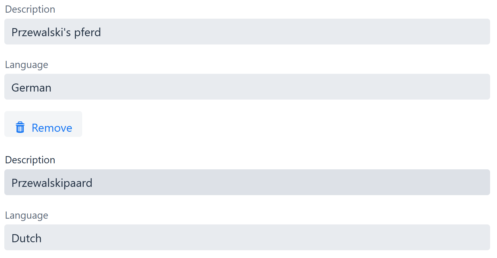

As you can see, the application renders a number of sub-forms below each
other, one for each dependent entity. There is also an *Add* button
below the last sub-form that can be used to add new forms at the end.

Note that the sub-forms used here tend to take up quite a bit of screen
space and that it will not be very user-friendly if the user has to
manage large collections using this component, so the
*DetailsEditLayout* is best used when you know the dependent collection
will stay quite small (and can be managed in-memory).

To save space, it’s also possible to specify that fields must be
displayed on the same line by usying the *groupTogetherWidth*
functionality discussed before.

Also, by default you will see that the grid is idented and preceded by a
label (in this case “translations”). If you’d rather display the grid
without the indentation, you can set the system property
*ocs.indent.grids* to false in *application.properties.*

=== Button bars and additional callbacks

As you have seen, the composite layout components like
*SimpleSearchLayout* contain a button bar (or multiple bars, in case of
a *SplitLayout*) of which the contents changes depending on the screen
mode and the selected form options. This allows you to perform basic
actions like navigating, saving, deleting etc. However, in some cases
this is not enough and you might want to add additional buttons to the
button bar.

If you want to do this, you can do so by calling the
*setPostProcessMainButtonBar* method of the component. Let’s do this in
the *PersonView* by adding the following inside the layout:

layout.setPostProcessMainButtonBar(buttonBar -> \{

Button notificationButton = *new* Button("Show name");

notificationButton.addClickListener(event -> \{

showErrorNotification(layout.getSelectedItem().getNickName());

});

buttonBar.add(notificationButton);

});

The code above will add a button that will simply display a message
containing the user’s nickname when clicked. Go ahead and try it out. It
will work fine with the one exception that the button can be clicked
when no row is selected, resulting in a rather ugly stack trace.

We can fix this by adding a single line of code. After the instantiation
of the button, add the following line:

layout.registerComponent(notificationButton);

This will make sure the button will only be enabled if a row is selected
in the grid.

If you need more control about when the button will be enabled (e.g.
only for certain entities), you can call the *mustEnableComponent*
method. This method is called whenever a row in the grid is selected so
you can use it to control precisely when to enable and when to disable
the button.

As an example, replace the previous code for the
“setPostProcessMainButtonBar” by the following:

layout.setPostProcessMainButtonBar(buttonBar -> \{

Button notificationButton = *new* Button("Show name");

notificationButton.addClickListener(event -> \{

showErrorNotification(layout.getSelectedItem().getNickName());

});

buttonBar.add(notificationButton);

layout.registerComponent("notificationButton", notificationButton);

});

layout.setMustEnableComponent((com, ent) -> \{

*if* (layout.isRegisteredComponent("notificationButton", com)) \{

*return* ent.getFirstName().startsWith("M");

}

*return* *true*;

});

Here, we make a small change to the “registerComponent” method, passing
along an extra parameter “notificationButton”. In the
“setMustEnableComponent”-method, which is called for every registered
compoment, we then check if we are dealing with the registered button

Dynamo allows you to specify the location and type of error message by
passing the _position_ and _variant_ arguments to the *showNotification*
method. In the example above, we use the *showErrorNotification* method
which is a shorthand method that specifies the position as “middle” and
the style as “error”. You can also use the *showTrayNotification* method
to display a message in the bottom right corner of the screen.

The *postProcessButtonBar* method allows you to add buttons to the
button bar below the results grid in a *SimpleSearchLayout*,
*SplitLayout*, or *EditableGridLayout*. If you want to edit the button
bar above/below an edit form, use the *setPostProcessDetailButtonBar*
method instead. Obviously, this method does nothing in the
*EditableGridLayout.*

Finally, to add buttons to the button bar below the search form in a
*SimpleSearchLayout* you can call the *setPostProcessSearchButtonBar*
method.

In addition to the callback methods for editing the button bars, the
composite layout components offer several other callbacks. These
include:

* *setAfterEntitySelected –* this method is called after an entity is
selected in the grid in a *SplitLayout* or *SearchLayout*.
* *setAfterModeChanged –* this method is called after the mode changes
from view mode to edit mode or vice versa.
* *setCreateEntity –* this method is called before opening setting the
screen in *Add* mode. It can be used to e.g. set default values on the
newly created entity. _Note that the Dynamo Framework already has
functionality for setting default values when creating new entities, by
means of the “default” setting on the @Attribute annotation – but if you
need something a bit more advanced, you can use this callback._
* *onAdd* – This method is called when the *Add* button is clicked.
Normally it will open the edit form in “add” mode but you can call this
method to modify this (e.g. to navigate to a different view).
* *onEdit* – This method is called when the “Edit” button is clicked.
Normally it will open the detail view but you can call this method to
modify this behaviour.
* *onRemove* – This method is called when the “Remove” button is clicked
(and after the user has confirmed the deletion). By default, this will
call the remove method on the service.
* *setEditAllowed* – This method can be used to determine whether
editing is allowed. This method will normally be used to check whether a
user has the correct roles that allow them to make changes.
* *setPostProcessEditFields –* this method is called once after the edit
form has been constructed. Use it to e.g. set up dependencies between
fields (“if field A contains value B, disable field D and set the value
of field E to F”).
* *setAfterLayoutBuilt –* this method is called after the layout has
been constructed. Use it to make any modifications that can only be done
after the composite component has been constructed. This can include
things like changing button captions, adding additional components at
the bottom of the layout etc.

The *SimpleSearchLayout* offers some additional callback methods:

* *setAfterClear* – a callback method that is called after the user
presses the “clear” button.
* *setAfterSearchPerformed –* a callback method that is called after a
search has been performed.
* *validateBeforeSearch -* this method is called after the Search button
is called but before the search is carried out. It can be used to check
if certain filter values are set and can be used to e.g. abort the
search (by throwing an *OCSValidationException*) if this is not the
case.

Let’s try out some of these callback methods. Open the
*OrganizationView* again, and add the following code:

layout.setCreateEntity(() -> \{

Organization org = *new* Organization();

org.setName("Cozy Nostra");

*return* org;

});

Restart the application, go to the Organizations screen, press the *Add*
button and verify that the value you specified above is already filled
in in the address field.

Next, add the following code to the OrganizationView:

layout.setPostProcessEditFields(editForm -> \{

ComboBox<Reputation> reputation =
editForm.getField("reputation", ComboBox.*class*)#;

TextField yearlyMortality = editForm.getField("yearlyMortalityRate",
TextField.*class*);

reputation.addValueChangeListener(event -> yearlyMortality.clear());

});

Here, we set up a change listener that triggers when the value of the
“reputation” field changes. It responds by clearing the value of the
“yearly mortality rate” field. This is a contrived example but it shows
how the post-processing can be used to set up inter-field dependencies.

_In older versions of Vaadin, you could clear a field by calling
setValue(null). This no longer works since setting a Null value will
result in an exception. Use the clear() method instead._

Finally, add the following code:

layout.setValidateBeforeSearch(() -> \{

*if* (!layout.isFilterSet("countryOfOrigin")) \{

*throw* *new* OCSValidationException("Please select a Country of
Origin");

}

});

Restart the application, then try to perform a search in the
Organisation screen. Verify that you will get an error message (and no
search will be performed) when you try to carry out a search without
first selecting a country.

=== Flexible Search Layout

In addition to the *SimpleSearchLayout* the application also supports
another search layout, named the *FlexibleSearchLayout.* This layout
offers an alternative way of constructing a search query.

To test the *FlexibleSearchLayout,* open the *OrganizationView* and
replace the *SimpleSearchLayout* by the *FlexibleSearchLayout* (really,
all it takes is changing the class name).

Now if you go to the Organization screen again, you will see the
following:

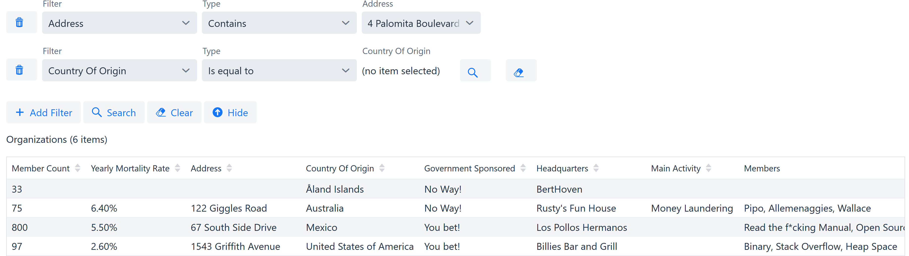

The top part of the screen now contains an (initially empty) search
screen with an *Add Filter* button below it. Click this button and an
empty search filter row will show up.

The search filter row consists of:

* A *Remove* button that can be used to remove the filter.
* A *Filter* combo box that allows you to select an attribute to filter
on
* A *Filter type* combo box that allows you to select the type of
filter. The available values depend on the type of the selected
attribute.
* One or two components that can be used to specify the value or values
to filter on – the components that will show up here are the same as in
the *SimpleSearchLayout* e.g. a text field for searching on a String
attribute, a combo box for selecting from a list etc. The behaviour of
these components can also be modified by the entity model (selectMode,
SearchSelectMode etc.).

As an example, this is a filter row for selecting all organizations with
a certain country of origin:

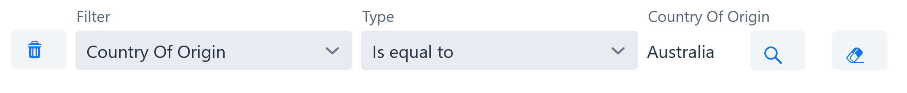

Of special interest is how this layout deals with attributes that are
*required for searching.* You can use the *requiredForSearching* setting
on the @Attribute annotation to specify that the user must always enter
a value for this attribute before he can carry out a search.

In a *SimpleSearchLayout* the search component for such an attribute
will simply appear with an asterisk behind its caption, but in the
*FlexibleSearchLayout* there will be a mandatory, non-removable search
filter row for every required attribute. Try this by setting the
*requiredForSearching* setting for the reputation field to true:

@Enumerated(EnumType.*_STRING_*)

@Attribute(searchable = *true*, requiredForSearching = *true*)

*private* Reputation reputation;

Then, restart the application and verify that you will now see a
non-removable filter row at the top of the search screen:

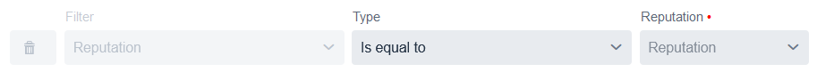

=== Excel and CSV Exports

A very useful capability of the framework is the option to export the
contents of any grid to Excel or CSV format. To make this possible, open
the *application.properties* file and make sure it contains the
following line:

ocs.allow.list.export=true

Also, in the pom.xml file for the gts-ui project, add the following
dependency:

<dependency>

<groupId>org.dynamoframework</groupId>

<artifactId>dynamo-frontend-export</artifactId>

</dependency>

This will add the *dynamo-frontend-export* module which contains the
export functionality.

After this, restart the application, open any screen, and right-click on
any grid. This will bring up the following dialog:

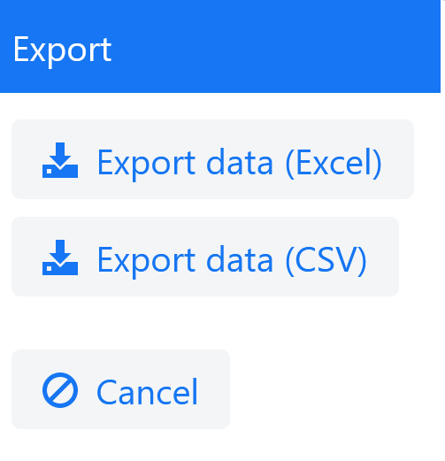

As you can see, there are two buttons that respectively allow you to
export the contents of the grid to Excel or to CSV. Note that the export
contains all the rows in the result set, not just the visible rows.

By default, only the columns that are shown in the grid will be
exported. If you’d rather export all (visible) properties of the model
instead, you can use the *FormOptions* to change the export mode:

FormOptions fo = *new* FormOptions().setExportMode(ExportMode.*_FULL_*);

When using the *FULL* export mode it’s possible that you need to fetch
additional relations that are note needed for displaying the data in the
grid. You can specify these additional relations by using the
*setExportJoins* method:

layout.setExportJoins(*new* FetchJoinInformation[] \{ *new*
FetchJoinInformation("countryOfOrigin"),

*new* FetchJoinInformation("members") });

When set, the *exportJoins* will override the normal joins

You can also use the *setExportEntityModel* method (on the layout, not
on the FormOptions) if you need more fine-grained control over which
properties to include (and how to include them) in the export.

Note that if you don’t want the users to be able to export the contents
of all grids, You can enable or disable the export functionality for
individuals components by using the *FormOptions* object and setting the
*ExportAllowed* flag to the desired value.

=== More system properties

In addition to the functionality described in the previous section, you
can use several other system properties to tweak the functionality of
the Dynamo Framework.

E.g., suppose you want to modify the default number of decimals to use
when displaying or editing a decimal value. By default, this is set to
*2* but you can change it e.g.to *3* by including the following system
property:

*ocs.default.decimal.precision=3*

Add this to your *application.properties* then restart the application
and verify that e.g. the “yearly mortality rate” can now be entered with
a precision of three decimals.

Note that if you want, you can overwrite the decimal precision for a
certain property again by using the *precision* setting on the
*@Attribute* annotation.

To programmatically access the value of a Dynamo system property, you
can use the static methods from the *SystemPropertyUtils* class.

Some other settings that you can modify using the system properties:

* *ocs.default.date.format* can be used to set the default date format
* *ocs.default.time.format* can be used to set the default time format
* *ocs.default.datetime.format* can be used to set the default date/time
format
* *ocs.default.datetime.zone.format* can be used to set the default
tame/time format for timestamps that include a time zone.

Refer to the full documentation of the framework or the
*SystemPropertyUtils* class for more information.

=== Clickable Links

For some properties, it is possible to change the default way they are
displayed (simply as a text or a label) inside a grid or an edit form to
a hyperlink that allows navigation within the application.

We will demonstrate this using the *organization* property of the
*Person.* Change the code of the Person class so that is read as
follows:

@Attribute(navigable = *true*, visibleInGrid = VisibilityType.*_SHOW_*)

*private* Organization organization;

Next, open the *GtsUI* class and check out the following piece of code:

uiHelper.addEntityNavigationMapping(Organization.*class*, item -> \{

uiHelper.setSelectedEntity(item);

uiHelper.navigate(Views.*_ORGANIZATION_VIEW_*);

});

The *navigable* setting on the *@Attribute* annotation will make sure
that whenever the property is shown in read-only mode, a hyperlink will
be rendered instead of just a textual representation. When the user
clicks on the hyperlink, the application will look at the class of the
selected item to determine what to do next. This can be defined by using
the *addEntityNavigationMapping* method. This method takes two
parameters: the class of the entity and a consumer that consumes the
clicked item – in this case, it does so by storing it on the UI
(setSelectedEntity) and then navigating to the specified view.

When you start the application now, go to the Person screen, and click
on a link in the grid, the application will navigate to the Organization
screen but it will not display the proper detail screen for the selected
entity yet, which is what we want.

Some custom code is needed to make sure the correct item is displayed in
the detail screen. Open the *OrganizationView* class and add the
following at the bottom of the *doInit* method:

*if* (getUiHelper().getSelectedEntity() != *null*) \{

Organization org = (Organization) getUiHelper().getSelectedEntity();

layout.edit(organizationService.fetchById(org.getId()));

getUiHelper().setSelectedEntity(*null*);

}

This code will check the *GtsUI* for the presence of a selected entity
and if it is there, makes sure that the detail screen is displayed by
calling the *layout.edit()* method.

Now, start the application again and verify that you are indeed taken to
the detail screen for the selected organization after clicking on a link
in the grid in the *Persons* screen.

You may think that this process of navigation is a bit cumbersome and
we’d be inclined to agree – however it is necessary because Dynamo only
concerns itself with individual composite components, not the flow
between screens. In order to give the developer as much freedom as
possible over how to structure the screens and the flow between them,
the navigation mechanism described above is kept an generic and
unobtrusive as possible, but this does mean that occasionally you’ll
have to write a couple of lines of code to make sure it work correctly.

=== Pluggable component creation

In version 2.10, the component creation process has undergone a major
update. Previously, it was fairly hard to modify which components are
created for which attributes, but this has become a whole lot easier
now.

Basically, the component creation process in Dynamo has now been split
over about 20 separate classes named ComponentCreators. Each
ComponentCreator is responsible for creating a specific type of
component, e.g. a text field or a number field.

The specifics of this mechanic are a bit beyond this training, but as an
example, we will show how it is possible to e.g. change the process so
that all text fields are replace by text areas:

To do so, create a new class named MyTextFieldComponentCreator and
implement it as follows:

@org.springframework.stereotype.Component

*public* *class* MyTextFieldComponentCreator *extends*
TextFieldComponentCreator \{

@Override

*public* Component createComponent(AttributeModel am,
FieldCreationContext context) \{

TextArea ta = *new* TextArea();

*return* ta;

}

}

This component extends the standard TextFieldComponentCreator which is
tasked with creating text field, and overrides the “createComponent”
method to produce text area’s instead.

Now, restart the application and verify that all text fields have now
indeed been replaced by text areas.

In additional to overriding an existing component creator, you can also
add your own component creator. This can be done by simply implementing
your own component creator and then registering this component with the
Dynamo framework. This is covered in more detail in the full manual.

== Authorization

The Dynamo framework comes with built-in support for authorization. This
support both allows you to show/hide certain screens for certain users,
and to disable or enable certain functionality within a screen (e.g. if
a certain button shows up).

To test this, open the *PersonView* and modify the class declaration by
adding the *@Authorized* annotation as follows:

@UIScope

@SpringView(name = Views.*_PERSON_VIEW_*)

@Authorized(roles = "admin")

*public* *class* PersonView *extends* BaseView \{

This will make this view only available to the users in the “admin” role
(which you currently aren’t assigned to). Start the application and
check that you indeed can no longer see the *PersonView* show up in the
menu. Also, check that if you directly navigate to the view (by entering
the URL *http://localhost:8080/personView* directly in the browser’s
address bar), you will get an error message.

Open the *GtsSecurityAdapter* class and change the *authorities* by
adding the “admin” role so that it reads as follows:

.authorities("user", "admin");

Restart the application and verify that you can now access the
*PersonView* again.

Now, let’s add some programmatic security. Go to the *PersonView* once
again and, add the following line:

layout.setEditAllowed(() -> userDetailsService.isUserInRole("super"));

This will ensure that the component can only be edited if the user is in
the “super” role. Since this is not the case, you will no longer be able
to edit the data in the Members screen. Restart the application and
verify this is indeed the case. Then, add the “super” role to the
*authorities* in the *GtsSecurityAdapter*, restart, and check that you
can once again edit the data in the Members screen.

So, what does it take to get this working? Very little actually. The
authorization mechanism depends on the following Spring Boot
configuration:

@Bean

@ConditionalOnMissingBean(value = PermissionChecker.*class*)

@ConditionalOnProperty(name =
DynamoConstants.*_SP_ENABLE_VIEW_AUTHENTICATION_*, havingValue = "true")

*public* PermissionChecker
permissionChecker(@Value("$\{ocs.view.package:}#") String
basePackage) \{

*return* *new* DefaultPermissionCheckerImpl(basePackage);

}

@Bean

@ConditionalOnMissingBean(value =
AuthenticationServiceInitListener.*class*)

@ConditionalOnProperty(name =
DynamoConstants.*_SP_ENABLE_VIEW_AUTHENTICATION_*, havingValue = "true")

*public* AuthenticationServiceInitListener authenticationInitListener()
\{

*return* *new* AuthenticationServiceInitListener();

}

@Bean

@ConditionalOnMissingBean(value = UserDetailsService.*class*)

*public* UserDetailsService userDetailsService() \{

*return* *new* DefaultUserDetailsServiceImpl();

}

The *UserDetailsService* is a wrapper around the Spring user management
functionality and can be used to check whether a user is in a certain
role. The *PermissionChecker* does a classpath scan for all classes
annotated with *@Route* and will check which roles can access which
views. Note that it takes a single constructor argument which is the
root package to scan (i.e. only *@Route* annotated classes inside that
package will be picked up). The *PermissionChecker* will combine the
data from scanning the views with the role data from the
*UserDetailsService* to determine if the user may access a certain
screen.

Finally, the *AuthenticationServiceInitListener* is the hook into the
Spring Vaadin framework – it will make sure that once you try to access
a view, the *PermissionChecker* will be called to determine whether the
user has access to that view.

== Element collections

One of the lesser known features of JPA is the ability to work with
*element collections* and *collection tables*. An element collection is
basically a collection of primitive values (String, integer, etc.) that
can be defined as a property on an entity. Within the context of our
example, we could define the following in the *Person* class:

@ElementCollection

@CollectionTable(name = "person_lucky_numbers")

@Column(name = "lucky_number")

@Attribute(complexEditable = *true*)

*private* Set<Integer> luckyNumbers = *new* HashSet<>();

Go ahead and add the above code to the Person class.

This will define a collection of integers that can be used to store a
person’s lucky numbers. As you can see, these are stored in the database
in a table named “person_lucky_numbers”. The definition for this table
is as follows:

CREATE TABLE person_lucky_numbers

(

id serial NOT NULL,

person_id integer,

lucky_number integer,

primary key(id)

);

ALTER TABLE person_lucky_numbers ADD CONSTRAINT
fk_person_lucky_numbers_person FOREIGN KEY (person_id)

REFERENCES person(id) ON DELETE CASCADE;

Go ahead and execute these commands in pgAdmin.

Finally, go to the *PersonDaoImpl* class and add “luckyNumbers” to the
fetch joins, as follows:

@Override

*protected* FetchJoinInformation[] getFetchJoins() \{

*return* *new* FetchJoinInformation[] \{ *new*
FetchJoinInformation("organization"),

*new* FetchJoinInformation("luckyNumbers")};

}

Restart the application and navigate to the screen for managing persons.
Select a Person and verify that you will now see a simple grid component
for managing the person’s lucky numbers. This component consists of a
grid (initially empty) and an *Add* button. You can use this button to
add a new empty row to the grid into which you can enter the required
value. Every row also comes with a button that can be used to remove the
value.

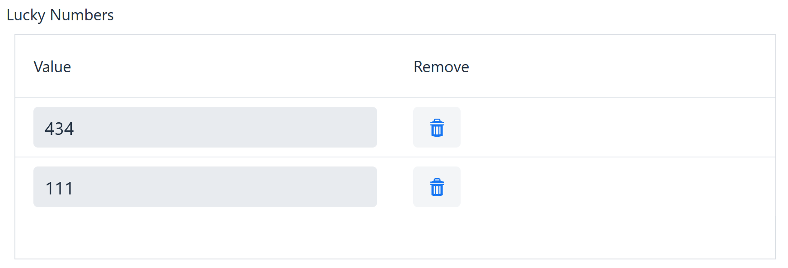

You can also add some simple validations to the values inside an element
collection grid. For example, to define a minimum or maximum length for
String values, you can use the *minLength* and *maxLength* settings from
the attribute model. For Long and Integer values, you can use the
*minValue* and *maxValue* settings to define a minimum and maximum
value.

This looks as follows in the *Person* class:

@ElementCollection

@CollectionTable(name = "person_lucky_numbers")

@Column(name = "lucky_number")

@Attribute(complexEditable = *true*, minValue = 10, maxValue = 25)

*private* Set<Integer> luckyNumbers = *new* HashSet<>();

Here, we define a minimum and maximum value of respectively 10 and 25.
Restart the application and verify that you can now only save your
changes if the values entered in the grid are within these bounds.

Notes:

* JPA defines lots of functionality related to collection tables.
Currently, Dynamo only supports the most basic scenarios in which a
collection table with one column in mapped to a collection.
* Dynamo currently supports this functionality for collections of
String, Integers, Longs, and BigDecimals.

== Advanced Example

This section contains a more advanced example for which not all details
have been filled in. You must use all the knowledge you have gained so
far and will also have to figure out some things by yourself.

What we want you to do is create a new screen that contains several
overviews, but now on the level of an organization (as opposed to the
screens so far which simply displayed all the data in the system).

=== New view 

First, create a new view named *organisationDetailView*. You can use any
of the existing views as an inspiration for this. Simply add the
skeleton for the view, do no create any layouts yet. Also, do *not* add
this view to the menu yet – we will not navigate to it directly from the
menu but perform a programmatic navigation.

=== Modify OrganizationView 

We will now modify the *OrganizationView* – we will add a button that,
when clicked, navigates to the new *organisationDetailView* that will
display the data about the sales organization that you selected in the
grid.

This involves:

* Adding a call to the the *setPostProcessMainButtonBar* method to the
*SimpleSearchLayout*.
* Creating a button and adding it to the button bar. The click listener
for the button should call the *navigate* method to perform the
navigation to the *organizationDetailView.* This looks as follows:

layout.setPostProcessMainButtonBar(buttonBar -> \{

Button navigateButton = *new* Button("Navigate");

navigateButton.addClickListener(event -> \{

getUiHelper().setSelectedEntity(layout.getSelectedItem());

getUiHelper().navigate(Views.*_ORGANIZATION_DETAIL_VIEW_*);

});

buttonBar.add(navigateButton);

layout.registerComponent(navigateButton);

});

* The code abouv will store the entity that is selected in the grid on
the current UI object. The UI is a Vaadin concept that roughly
corresponds to a browser tab: by storing data like this, you can
retrieve it from different views in the same browser tab. This allows
you to create applications that continue to work if the client has the
application open in multiple browser tabs.
* Note that Vaadin also allows you to store data in the VaadinSession
(which corresponds to the HTTP session). This can sometimes be useful
e.g. if you want to store a session-wide locale, but if you store other
things (e.g. a selection made by the user) on the session level this
will break the multiple browser window functionality (the different
windows can interfere with each other).
* Start the application and verify that you can navigate to the new
view. In the new view, add code to retrieve the selected organization
and verify it is set correctly (e.g. by logging something to the command
line).

=== Add a TabLayout

Inside the new *organisationDetailView* that you just created, create an
instance of the framework class *TabLayout* and add it to the screen.

This is an class for creating a layout that displays various tabs. A
simple implementation looks as follows:

Organization org =
getUiHelper().getSelectedEntity(Organization.*class*);

TabLayout<Integer, Organization> tabLayout = *new* TabLayout<Integer,
Organization>(org);

tabLayout.setTitleCreator(() -> "Look at my organization");

tabLayout.setCaptions(*new* String[] \{ "Details" });

tabLayout.setTabCreator(index -> \{

*switch* (index) \{

*case* 0:

EntityModel<Organization> em =
getModelFactory().getModel(Organization.*class*);

*return* *new* SimpleEditLayout<Integer, Organization>(org,
organizationService, em, *new* FormOptions());

}

*return* *null*;

});

main.add(tabLayout);

* *setTitleCreator* is used to determine the title that will appear in
the title bar of the layout. This is optional, if you do not call this
method the application will simply not show a title above the tabs.
* *setCaptions* returns a String array of the titles of the various
tabs. This method is used to determine how many tabs you want to
display. For now, return a String array that contains a single String
“Details”.
* *setTabCreator* is used to lazily create a tab when the user requests
it. This method takes a lambda that takes a single parameter, the
zero-based index of the tab. In the example above, we construct a
SimpleEditLayout for displaying the details of the organization we
selected in the OrganizationView.

Now, with the above code in place, start the application then go to the
organization view, select a row in the grid and click the navigate
button. You should see something like this:

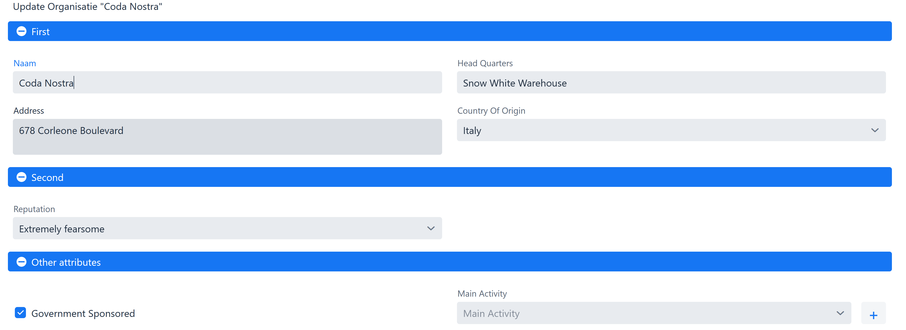

* Change this screen so that it opens in view mode and displays an
*Edit* button by modifying the *FormOptions*.
* You can add an icon in front of a tab by implementing the
“setIconCreator” method, e.g.:

tabLayout.setIconCreator(index -> \{

*return* VaadinIcon.*_ACADEMY_CAP_*.create();

});

=== Add an additional tab

Now, it is time to add an additional tab to the *TabLayout*. Add a
String “Members” to the String array that is returned from the
*getTabCaptions* method and modify the *initTab* method so that it will
return a *ServiceBasedDetailLayout* when the tab with index 1 is
returned:

ServiceBasedDetailLayout<Integer, Person, Integer, Organization> layout
= *new* ServiceBasedDetailLayout<Integer, Person, Integer,
Organization>(

personService, tabLayout.getEntity(), organizationService,

entityModelFactory.getModel("OrganizationPerson", Person.*class*),
QueryType.*_ID_BASED_*,

*new* FormOptions(), *null*);

layout.setCreateEntity(() -> \{

Person person = *new* Person();

person.setOrganization(tabLayout.getEntity());

*return* person;

});

layout.setParentFilterCreator(

item -> *new* EqualsPredicate<Person>("organization",
tabLayout.getEntity()));

*return* layout;

You also have to add the following declarations at the top of the class
to make the code compile:

@Autowired

*private* OrganizationService organizationService;

@Autowired

*private* PersonService personService;

*ServiceBasedDetailLayout* is a subclass of the
*ServiceBasedSplitLayout* you saw before – it functions in the same way
as the *ServiceBasedSplitLayout* but it keeps a reference to a parent
object (in this case the organization). Notice that we use this parent
object to construct a filter that will make sure only the members that
are a part of the current organization will be returned. Also, note how
we call the *setCreatEntity* method to make sure the correct
organization is set when creating a new Person.

Now, start the application and verify that you will now see a second tab
that displays the people that are members of the organization.

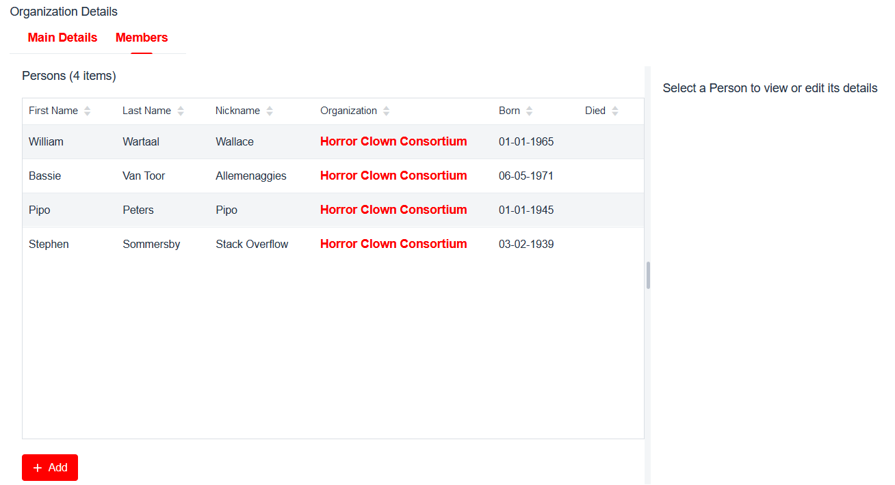

This tab contains one big flaw at this moment: you can still select a
user’s organization, which is not desired. To fix this, we must modify
the entity model, but for this screen only (otherwise we will break the
other *Members* screen).

Note that when instantiating the layout, we specified a custom entity
model for this screen:

getEntityModelFactory().getModel(

"OrganizationPerson", Person.*class*)

This will create a separate entity model just for this screen, which by
default inherits everything from the default entity model for the
*Person* class.

We can use the message bundle (entitymodel.properties) to overwrite the
behaviour for this screen by adding the following line:

*OrganizationPerson.organization.complexEditable=false*

Start the application and verify that the *organization* field indeed no
longer shows up in the edit form. Play around with this functionality a
bit more if you want (e.g. to overrule display names) and verify that
you can now add members that will automatically end up belonging to the
correct organization.

=== Add the final tab

As a final exercise, add another tab to the layout that displays the
deliveries made by persons that are members of the organization. This
involves setting up another *ServiceBasedDetailLayout* but now for the
*Delivery* entity. Make sure that you can add new deliveries but that
the *from person* field can only be selected from among the members of
the current organization (you will need to add a *field filter* on the
“fromPerson” to the layout to achieve this).

Tip: you must only show the deliveries made by persons from the selected
organizations, but this information is not stored directly on the
Delivery entity. You can instead retrieve it by going via the
“fromPerson” property, by defining the *setParentFilterCreator* method
as follows:

layout.setParentFilterCreator(

item -> *new* EqualsPredicate<Delivery>("fromPerson.organization",
getEntity()));

Tip: by default, the complex properties (fromPerson, toPerson, gift)
will not show up in the edit form, so you must modify the
*complexEditable* setting for these properties.
